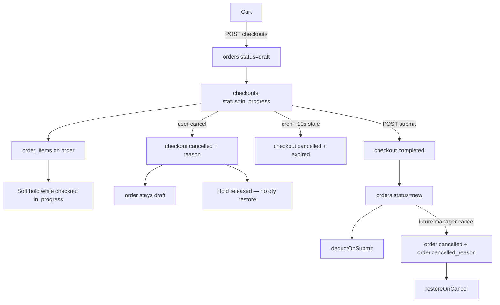

# Checkouts table — order created at checkout start

## Problem (unchanged)

Pre-submit exits and post-submit manager cancel must not share ambiguous inventory rules.

## New model (confirmed)

Two layers:

| Layer           | Role                                                                                                                               |
| --------------- | ---------------------------------------------------------------------------------------------------------------------------------- |
| **`orders`**    | Order record — **`draft`** from checkout start until submit → **`new`** → fulfillment. **`cancelled` only after `new`** (manager). |
| **`checkouts`** | Checkout session — **`order_id`**, **`status`**, **`cancelled_reason`**, expiry                                                    |



### Key rules

- **Multiple checkouts per session allowed** — no session unique constraint.
- **Hold window** — `created_at + CHECKOUT_HOLD_MS` (15 min). Used **only** in cron expiry + `expiresAt` in checkout API (UI timer). **Not** used in availability math.
- **Availability (simple)** — SUM `order_items` for all checkouts with **`status = in_progress`**. No time filter. Stale checkouts stay `in_progress` until cron flips them (~10–20s overshoot acceptable).
- **Cron** (~10s) — finds stale `in_progress` checkouts → `cancelled` + `expired`; order stays `draft`; hold released.
- **Cart and checkout are independent** — both scoped to `visitor_session_id`, not linked to each other. Cart idle (30 days) far outlasts checkout hold (15 min). **`resolveForCart` clears cart items only** — never cancels checkouts.
- **Reuse `order_items` + `order_deliveries`** — FK → `orders(id)`.
- **On checkout success:** `checkouts.status = completed`, `orders.status = new`.
- **On checkout failure:** `checkouts.status = cancelled` + reason; **`orders.status` stays `draft`** — incomplete order, not a cancelled order.
- **`orders.cancelled` is unreachable from draft** — only manager cancel on `new+`. No dual-meaning `cancelled` status.

### Inventory invariant (clean)

| `order.status` | Can `order.cancelled`?        | Qty effect on exit                     |
| -------------- | ----------------------------- | -------------------------------------- |
| `draft`        | **No** — cancel checkout only | Hold released via checkout; no restore |
| `new+`         | **Yes** — manager cancel      | `restoreOnCancel`                      |

No branching on cancel reason for stock logic. Status alone tells the story.

---

## Schema

### New: `checkouts`

| Column                                   | Notes                                                             |
| ---------------------------------------- | ----------------------------------------------------------------- |
| `id`                                     | UUID v7 — checkout session id (primary API/URL id)                |
| `order_id`                               | FK → `orders(id)` UNIQUE — one checkout per order                 |
| `visitor_session_id`                     | FK → visitor_sessions                                             |
| `status`                                 | **`in_progress`** (default) \| **`completed`** \| **`cancelled`** |
| `cancelled_reason`                       | Nullable; only when `status = cancelled`                          |
| `completed_at`                           | Set when `status = completed`                                     |
| `created_at`, `updated_at`, `deleted_at` | Hold window from `created_at`                                     |

No partial unique index on session — multiple `in_progress` checkouts per visitor are valid.

### Existing: `orders`

| Column                         | Notes                                                                                    |
| ------------------------------ | ---------------------------------------------------------------------------------------- |
| `status`                       | **`draft`** → **`new`** → fulfillment → **`cancelled`** (manager only, never from draft) |
| `cancelled_reason`             | Set only on manager cancel (`new+`)                                                      |
| `customer_name`, `phone`, etc. | Filled progressively during checkout                                                     |

Fulfillment: `new` → `confirmed` → `arrived` → `completed` | `returned` | `archived`

**Orphan draft orders:** when checkout is cancelled/expired, order stays `draft` — inert snapshot, no hold. Multiple per session over time is expected.

**Remove** `OrderStatus.Abandoned` — superseded by checkout `cancelled` + order `draft`.

### Reused (FK → orders)

- `order_items`
- `order_deliveries`

---

## Enums

```typescript
export enum CheckoutStatus {
  InProgress = 'in_progress',
  Completed = 'completed',
  Cancelled = 'cancelled',
}

export enum CheckoutCancelledReason {
  User = 'user',
  Expired = 'expired',
}

export enum OrderStatus {
  Draft = 'draft', // incomplete — checkout not completed or checkout cancelled
  New = 'new',
  Confirmed = 'confirmed',
  Arrived = 'arrived',
  Completed = 'completed',
  Cancelled = 'cancelled', // manager only — never set while checkout was still draft
  Returned = 'returned',
  Archived = 'archived',
}

export enum OrderCancelledReason {
  CustomerRequest = 'customer_request',
  OutOfStock = 'out_of_stock',
  // manager cancel only
}
```

---

## Inventory rules (simplified)

**Philosophy:** reserve accuracy is eventual, not real-time. Holds release when checkout status changes — not by time math in SUM queries.

```typescript
// inventory — status only, no createdAt filter
export function inProgressCheckoutWhere() {
  return { status: CheckoutStatus.InProgress } satisfies FindOptionsWhere<Checkout>;
}

// sumReservedQty: order_items JOIN checkouts ON order_id WHERE inProgressCheckoutWhere()
```

```typescript
// checkout.config.ts — freshness helpers (cron + API only, NOT inventory)
export const CHECKOUT_HOLD_MS = 15 * 60_000;

export function isCheckoutExpired(checkout: Checkout, now = Date.now()): boolean {
  return (
    checkout.status === CheckoutStatus.InProgress && checkout.createdAt.getTime() <= now - CHECKOUT_HOLD_MS
  );
}

export function checkoutExpiresAt(checkout: Checkout): string {
  return new Date(checkout.createdAt.getTime() + CHECKOUT_HOLD_MS).toISOString();
}
```

| Where                              | Uses time filter?                         |
| ---------------------------------- | ----------------------------------------- |
| `getAvailableQty` / cart reconcile | **No** — `in_progress` only               |
| Cron `expireStaleCheckouts`        | **Yes** — `in_progress` + past hold       |
| `getCheckout` → `expiresAt`        | **Yes** — computed for UI timer           |
| `submitCheckout` guard             | **Yes** — reject if expired (lazy cancel) |

| Event          | Checkout      | Order       | Hold                      |
| -------------- | ------------- | ----------- | ------------------------- |
| Active         | `in_progress` | `draft`     | Counted in SUM            |
| User cancel    | `cancelled`   | `draft`     | Released immediately      |
| Cron expiry    | `cancelled`   | `draft`     | Released within ~10–20s   |
| Submit         | `completed`   | `new`       | Released + deductOnSubmit |
| Manager cancel | —             | `cancelled` | restoreOnCancel           |

---

## Service boundaries

### `CheckoutService`

| Method                                      | Behavior                                                                                                          |
| ------------------------------------------- | ----------------------------------------------------------------------------------------------------------------- |
| `startFromCart(visitorSessionId)`           | Create order(`draft`) + checkout(`in_progress`) + items; clear cart. **Does not cancel other session checkouts.** |
| `getCheckout(checkoutId, visitorSessionId)` | Return checkout + order; `expiresAt` for UI; lazy-reject if expired                                               |
| `updateCheckout(...)`                       | PATCH order fields while checkout active                                                                          |
| `cancelCheckout(checkoutId, reason)`        | checkout → `cancelled` + reason; order stays `draft`                                                              |
| `expireStaleCheckouts()`                    | Cron ~10s: stale `in_progress` (past CHECKOUT_HOLD_MS) → `cancelled` + `expired`                                  |

Remove `cancelSessionCheckouts` and **`VisitorSessionService` must not cancel checkouts on cart idle** — delete current `cancelExpiredDrafts` coupling when migrating.

### `OrdersService`

| Method                      | Behavior                                                                                               |
| --------------------------- | ------------------------------------------------------------------------------------------------------ |
| `submitCheckout(...)`       | checkout → `completed`; order → `new`; `deductOnSubmit`; Telegram                                      |
| `cancelSubmittedOrder(...)` | **Future:** guard `order.status !== draft`; → `cancelled` + `OrderCancelledReason` + `restoreOnCancel` |

**No `cancelOrder` on draft orders** — only `cancelCheckout`.

---

## Multiple checkouts per session

A visitor may have several `in_progress` checkouts simultaneously. Each:

- Reserves inventory via its order's `order_items` while checkout is **`in_progress`**
- Releases hold when checkout → **`cancelled`** or **`completed`** (cron handles expiry → cancelled)
- **10–20s phantom reserve** after TTL until cron runs is acceptable

`startFromCart` always creates a **new** order + checkout; it never auto-cancels siblings.

---

## API routes

| Current                     | New                          |
| --------------------------- | ---------------------------- |
| `POST /orders/draft`        | `POST /checkouts`            |
| `GET /orders/:id`           | `GET /checkouts/:id`         |
| `PATCH /orders/:id`         | `PATCH /checkouts/:id`       |
| `DELETE /orders/:id/cancel` | `DELETE /checkouts/:id`      |
| `POST /orders/:id/submit`   | `POST /checkouts/:id/submit` |

URL: `/checkout/[checkoutId]`. Response includes `checkoutId` + `orderId`.

---

## Migration strategy

1. Create `checkouts` table (no session unique index).
2. Migrate in-flight draft orders → order(`draft`) + checkout(`in_progress`) if any.
3. Remove `Abandoned` status usage.
4. `orders.cancelled_reason` — manager-only going forward.

---

## Verification

- [ ] Multiple concurrent `in_progress` checkouts per session allowed; each holds inventory independently
- [ ] New checkout does not cancel existing session checkouts
- [ ] `sumReservedQty` counts all `in_progress` checkouts — no time filter
- [ ] Stale checkout still holds until cron (~10–20s overshoot OK)
- [ ] Cron expiry → checkout `cancelled`, order `draft`, hold freed
- [ ] `getCheckout` returns `expiresAt`; submit rejects expired (lazy)
- [ ] Submit → checkout `completed`, order `new`, qty deducted
- [ ] Double submit idempotent
- [ ] Draft order cannot be manager-cancelled (API rejects)
- [ ] Manager cancel only on `new+` restores qty
- [ ] Cart idle clears cart items only — checkouts unaffected

---

## Future: manager cancel (out of scope)

```typescript
async cancelSubmittedOrder(orderId: string, reason: OrderCancelledReason) {
  if (order.status === OrderStatus.Draft) {
    throw new OrderCancelNotAllowedException(order.status);
  }
  order.status = OrderStatus.Cancelled;
  order.cancelledReason = reason;
  await this.inventoryService.restoreOnCancel(lines);
}
```
