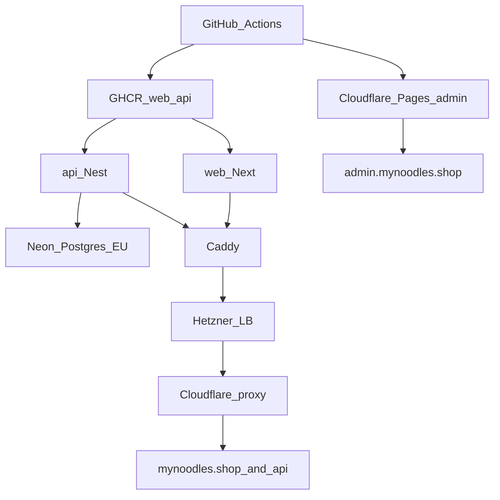
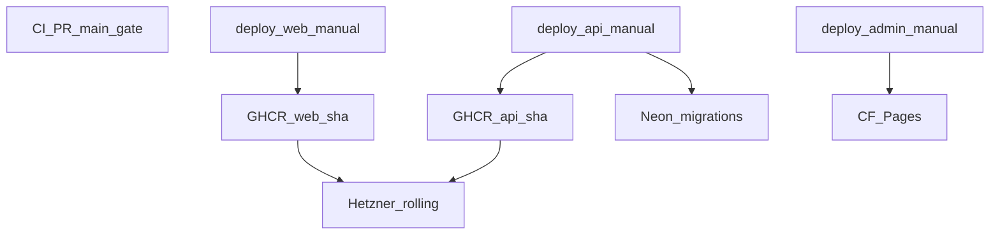

# HA-lite деплоймент my-noodles (без AWS/K8s на старті)

## Що таке Hetzner

**Hetzner** — німецький (EU) хмарний хостинг: VM, LB, network, firewall, Object Storage. DNS/CDN — Cloudflare.

| AWS                          | У нашій схемі                                     |
| ---------------------------- | ------------------------------------------------- |
| EC2                          | Hetzner Cloud Server (VM)                         |
| ALB/NLB                      | Hetzner Cloud Load Balancer                       |
| S3 (фото / shareable assets) | **Hetzner Object Storage** + Cloudflare CDN proxy |
| RDS PostgreSQL               | **Neon** (managed Postgres, EU)                   |
| S3+CloudFront для admin SPA  | **Cloudflare Pages**                              |
| Route53                      | Cloudflare DNS (Namecheap NS → CF)                |
| CloudFront                   | Cloudflare (proxy для web/api; Pages для admin)   |
| ECR                          | GHCR (лише web + api)                             |

---

## База даних: managed Neon (не self-hosted на Hetzner)

Hetzner **не має RDS**. Тримати Postgres на VM = патчі, WAL-бекапи, restore drills, дискові фейли — робота DBA. Для критичного вузла замовлень це поганий fit, якщо ви не DBA.

**Обрано: [Neon](https://neon.tech) (регіон EU, напр. Frankfurt).**

| Що дає Neon                                | Навіщо вам                                                |
| ------------------------------------------ | --------------------------------------------------------- |
| Managed Postgres + SSL connection string   | `DATABASE_URL` у Nest/TypeORM як зараз локально           |
| Автобекапи / point-in-time restore         | без wal-g і Object Storage для DB                         |
| Branches                                   | опційно для експериментів; **окремого staging env немає** |
| Патчі / storage / failover на їхньому боці | менше ops                                                 |

**Prod-налаштування: scale-to-zero увімкнено** (типово Idle після ~5 хв без запитів). Платимо за **CU-години + storage**, не за 24/7. Soft launch часто **~$0–15/міс** на DB.

**Cold start + TypeORM** (див. [Neon × TypeORM](https://neon.com/docs/guides/typeorm)):

- Після Idle перший connect будить compute (секунди). Дефолтний `connect_timeout=5` часто **не встигає** → помилка на кшталт «Can't reach database server».
- У prod `DATABASE_URL` додаємо **`connect_timeout=10`** (або вище), плюс `sslmode=require&channel_binding=require`.
- Runtime api: **pooled** connection string (`-pooler` у hostname) — PgBouncer, краще під concurrency.
- **Міграції TypeORM:** лише **direct** (non-pooled) URL — pooled/transaction mode ламає session-level ops міграцій.
- DataSource: `type: 'postgres'`, `url: process.env.DATABASE_URL`, `ssl: true` (як у гайді Neon).
- Опційно: легкий retry на перший failed connect після wake (на випадок рідкого >10s).

Коли cold start почне біти checkout UX при постійному трафіку — вимикаємо scale-to-zero на prod.

**Мережа:** api (Hetzner) → Neon SSL; credentials лише в secrets.

**Локально** — [docker-compose.yml](docker-compose.yml) Postgres для dev; prod major version узгоджуємо з Neon.

**Не беремо зараз:** Postgres VM на Hetzner, Patroni, RDS (дорого тягне в AWS).

---

## Вердикт: HA за LB (єдина prod-топологія)

**Prod:** Cloudflare → Hetzner LB11 → **2×** app VM (Caddy + web + api на кожній) + Neon. Без окремих «Tier 0 / Tier B» шляхів.

**Середовища:** лише **local** (dev на машині) і **prod**. Окремого staging (VM / Neon branch як env) немає — деплой з main іде в prod.

**Не зараз:** Kubernetes, Helm, AWS, multi-region, staging env, self-hosted Postgres/Patroni, admin-контейнер на Hetzner.

---

## Кошторис (MVP без відомого трафіку)

### Як рахувати, коли немає DAU

Інфра на Hetzner майже **фіксована**: платите за VM/LB/storage 24/7, не за «кількість відвідувачів». Трафік починає коштувати лише після великих обсягів (у CX зазвичай **~20 TB** egress/міс на VM — для соцмережевого soft launch це стеля, до якої далеко).

Тому для MVP кошторис = **сума завжди-увімкнених ресурсів**, не «€ за юзера».

Орієнтир цін Hetzner Cloud EU **після підвищення 2026** (excl. VAT; IPv4 окремо ~€0.5–1/шт):

| Ресурс                    | Типовий план               | ≈ €/$ міс                                     |
| ------------------------- | -------------------------- | --------------------------------------------- |
| App VM (web+api+Caddy)    | CX33                       | ~€6.50                                        |
| **Postgres**              | **Neon EU, scale-to-zero** | **~$0–15** (idle-heavy MVP; росте з CU-hours) |
| Load Balancer             | LB11                       | ~€7.50                                        |
| Object Storage (media)    | Hetzner OS base bucket     | ~€6.50                                        |
| Cloudflare + Pages + GHCR | Free                       | **0**                                         |
| Домен                     | Namecheap                  | ~€1                                           |

### Prod HA — 2× app + LB + Neon

| Стаття                    | ≈ /міс                               |
| ------------------------- | ------------------------------------ |
| App ×2 + IPv4             | ~€14–16                              |
| LB11                      | ~€7.50                               |
| Neon (scale-to-zero)      | ~$0–15+                              |
| Object Storage (media)    | ~€6.50                               |
| Cloudflare + Pages + GHCR | 0                                    |
| Домен                     | ~€1                                  |
| **Разом**                 | **~€30–45** (поки DB рідко «гаряча») |

### Що майже не додає вартості на MVP

- Трафік від постів у соцмережах (сотні–низькі тисячі візитів) — **€0** понад фікс.
- Admin на Pages — **€0** (статика unlimited на Free).
- Кеш `/_next/static` на Cloudflare — **€0**, трохи розвантажує origin.

### Порівняння: AWS «все в одній екосистемі» vs Hetzner + Cloudflare

Мапінг сервісів (eu-central-1 / Frankfurt орієнтир, on-demand, без Savings Plans; ≈ USD ≈ EUR для грубого планування; EU часто **+5–15%** vs us-east-1):

| Роль            | Hetzner + Cloudflare  | AWS all-in                                  |
| --------------- | --------------------- | ------------------------------------------- |
| App compute     | CX33 VM               | EC2 t3.medium / t4g.medium (або ECS на EC2) |
| DB              | **Neon** (managed)    | **RDS** PostgreSQL                          |
| LB              | Hetzner LB11          | **ALB**                                     |
| DNS             | Cloudflare Free       | **Route 53** (~$0.50/zone + queries)        |
| CDN             | Cloudflare Free       | **CloudFront** (pay per GB; на MVP мало)    |
| Admin SPA       | Cloudflare Pages Free | **S3 + CloudFront** або Amplify Hosting     |
| Images registry | GHCR Free             | **ECR** (майже $0 на MVP)                   |
| Backups DB      | Neon PITR             | RDS automated backups                       |
| TLS             | CF + Caddy            | **ACM** (безкоштовні certs)                 |
| Public IPv4     | ~€0.5–1/шт            | **~$3.60/шт**/міс (окремий «податок»)       |

#### AWS HA-lite (порівняння з нашою prod-топологією)

2× app за ALB + RDS single-AZ + CloudFront + S3 admin + Route 53. Без EKS.

| Стаття                                 | ≈ $/міс           |
| -------------------------------------- | ----------------- |
| EC2 ×2 t3.medium                       | 60–70             |
| ALB (base + мінімум LCU)               | 20–28             |
| RDS db.t4g.small (single-AZ) + storage | 30–40             |
| Elastic IP / public ENI                | 7–11              |
| CloudFront + S3 + Route 53             | 5–15              |
| **Разом (без NAT, без Multi-AZ)**      | **~$120–160**     |
| vs Hetzner HA (~€30–45)                | **~3–4× дорожче** |

| Апгрейд «справжній AWS HA» | Додає                            |
| -------------------------- | -------------------------------- |
| RDS Multi-AZ               | ≈ ×2 на DB → **+$30–40**         |
| NAT Gateway (1 AZ)         | **+$32–45**                      |
| Разом «enterprise-ish» MVP | **~$180–250+/міс** ще до трафіку |

#### Що купуєте дорожчим AWS (не лише $)

- Один акаунт, IAM, CloudWatch, billing alarms, mature Terraform AWS provider.
- Повна екосистема + RDS SLA на Scale-еквіваленті.
- Менше провайдерів **якщо** відмовитись від Cloudflare (ми навпаки лишаємо CF).

**Висновок:** **Hetzner (app) + Cloudflare (edge/admin) + Neon (DB)**. Managed DB беремо в Neon, не платимо за весь AWS лише заради RDS.

---

## Cloudflare Pages + IaC

- **Admin** (`apps/admin` → `vite build` → `dist/`) хоститься на **Cloudflare Pages**; домен `admin.mynoodles.shop`.
- Деплой: GitHub Actions + `wrangler pages deploy`.
- **OpenTofu** (Cloudflare provider): DNS zone records, Pages project, custom domain binding. Артефакти `dist/` не в tofu.

---

## CDN assets (фото і будь-які публічні файли)

Один піддомен на всі shareable об’єкти — **не** окремий домен «лише для фото». Новий тип файлів = новий **prefix у бакеті**, не новий hostname.

| Крок             | Де                                                                 |
| ---------------- | ------------------------------------------------------------------ |
| Зберігання       | **Hetzner Object Storage** (один bucket), IaC у tofu               |
| Віддача          | **`cdn.mynoodles.shop`** → Cloudflare **proxied** → Object Storage |
| Шляхи (приклади) | `products/…`, `files/…`, `misc/…`                                  |
| Upload           | api/admin через S3-compatible SDK + secrets з GitHub `prod`        |
| URL у БД         | `https://cdn.mynoodles.shop/products/…` тощо                       |

Окремий домен пізніше **не потрібен**, доки не з’явиться інший бренд/ізоляція. Cache rules на CF для hashed/immutable paths; public read на CDN prefixes; write лише з credentials.

---

## TLS (HTTPS)

| Ділянка                     | Хто видає / ротує     |
| --------------------------- | --------------------- |
| Browser → Cloudflare        | Universal SSL (авто)  |
| Browser → Pages (`admin.`)  | Cloudflare (авто)     |
| Cloudflare → Hetzner origin | **Origin CA** + Caddy |

**Origin (Full strict):**

1. Cloudflare SSL/TLS mode = **Full (strict)** (не Flexible).
2. **Cloudflare Origin CA** сертифікат з SAN на `mynoodles.shop`, `www.mynoodles.shop`, `api.mynoodles.shop` (через tofu `cloudflare_origin_ca_certificate` або разово в UI).
3. Private key **не в git**. Тримаємо в **encrypted OpenTofu state** і/або GitHub Environment secret → cloud-init / deploy кладе файли на VM для Caddy.
4. Caddy лише `tls cert.pem key.pem` (без Let’s Encrypt на origin — зайвий ACME за orange-cloud).

Ротація Origin CA рідка (довгий TTL); edge-сертифікати CF крутить сам.

---

## Secrets (де зберігати)

**Не Azure Key Vault / HashiCorp Vault на MVP** — зайвий акаунт/рахунок/ops при 1–2 людях і деплої з GitHub.

**Обрано:**

| Що                                                            | Де                                                                                                |
| ------------------------------------------------------------- | ------------------------------------------------------------------------------------------------- |
| App runtime (`DATABASE_URL`, OTEL, S3 media keys, API keys …) | **GitHub Environment `prod`** → deploy / `.env` на VM                                             |
| Infra (Hetzner/CF/Neon tokens, Origin CA key)                 | **Encrypted OpenTofu state** + мінімум GH secrets для `tofu apply`                                |
| Локальний dev                                                 | `.env` / `.env.local` (gitignore); media — локально або той самий bucket з dev prefix за бажанням |

Пізніше, якщо секретів стане багато або з’явиться команда: **Doppler** (простий UX, free/cheap tier) як шар над тим самим — без міграції на Azure.

Vault Microsoft (Azure Key Vault) має сенс лише якщо вже живете в Azure; для Hetzner+GH це дорожчий ментальний і грошовий overhead без вигоди.

---

## Web vs admin vs api

| App       | Runtime                | Де крутиться                  |
| --------- | ---------------------- | ----------------------------- |
| **web**   | Node (Next.js SSR/ISR) | Hetzner app VM, Docker з GHCR |
| **admin** | Немає — чиста статика  | **Cloudflare Pages**          |
| **api**   | Node (NestJS)          | Hetzner app VM, Docker з GHCR |



| Hostname                 | Куди                                                                |
| ------------------------ | ------------------------------------------------------------------- |
| `mynoodles.shop` / `www` | CF proxy → Hetzner LB → Caddy → **web**                             |
| `api.mynoodles.shop`     | CF proxy → Hetzner LB → Caddy → **api**                             |
| `admin.mynoodles.shop`   | **Cloudflare Pages**                                                |
| `cdn.mynoodles.shop`     | CF CDN proxy → **Hetzner Object Storage** (будь-які публічні файли) |

Caddy на нодах роутить лише `web` + `api`.

---

## Observability (замість CloudWatch)

У репо вже є OTel + Winston → OTLP ([`libs/api/src/otel`](libs/api/src/otel), local [`otel-lgtm`](docker-compose.yml)). На проді не піднімаємо свій Loki/Tempo стек — зайвий ops.

**Обрано: [Grafana Cloud Free](https://grafana.com/products/cloud/free-tier/)** — той самий стек, що локальний LGTM.

| Free (орієнтир)                                       | Достатньо для MVP?                      |
| ----------------------------------------------------- | --------------------------------------- |
| ~50 GB logs + ~50 GB traces / міс, ~10k metric series | Так при soft launch                     |
| Retention ~14 днів                                    | Ок для дебагу інцидентів                |
| OTLP ingest                                           | Сумісно з `OTEL_EXPORTER_OTLP_ENDPOINT` |

Prod: `OTEL_ENABLED=true` + endpoint/token Grafana Cloud на api (і web, якщо додамо). Local: без змін → `otel-lgtm`.

**Metrics тією ж OTLP-трубою:** у [`prepareInstrumentation`](libs/api/src/otel/instrumentation.ts) додати `OTEL_METRICS_EXPORTER=otlp` поруч із traces/logs (зараз metrics не експортуються). NodeSDK + auto-instrumentations віддадуть HTTP/runtime метрики на той самий `OTEL_EXPORTER_OTLP_ENDPOINT` → Grafana Cloud (Mimir/Prometheus). Ручні business counters — пізніше за потреби, не блокер MVP.

**Не беремо зараз:** self-hosted Grafana на Hetzner, Datadog, CloudWatch.

**Uptime** (окремо): ping `mynoodles.shop` / `api` — CF або Better Stack free; телеметрія app = Grafana Cloud L+T+M.

---

## IaC

У `devops/tofu/`:

- **hetzner** — LB11 + 2× app VMs, firewall (80/443 from LB), **Object Storage bucket** (media)
- **cloudflare** — DNS (`cdn.` proxied); Pages + `admin`; **Origin CA**; Full (strict)
- **neon** — console або tofu; URLs у GitHub `prod`
- **backend** — encrypted remote state

**Разово вручну:** Namecheap NS → Cloudflare; Neon + scale-to-zero; GitHub Environment `prod` only.

---

## Репо: `devops/`

```text
devops/
  README.md             # workflows, deploy/rollback, ref vs sha-*
  tofu/                 # Hetzner + Cloudflare
  compose/              # caddy + web + api (без admin)
  caddy/                # Host → web | api
  scripts/              # rolling deploy Hetzner
  docs/                 # NS / Neon PITR / Origin CA
```

[`devops/README.md`](devops/README.md) — операційна дока при імплементації:

- список Actions: `CI`, `deploy-web`, `deploy-api`, `deploy-admin` (+ шляхи до `.github/workflows/…`);
- флоу: PR gate → Run workflow → build/test апки → deploy;
- **ref**: `main` або git SHA без `sha-`; образ у GHCR = `sha-<short>`;
- rollback: той самий workflow + старий SHA;
- secrets у Environment `prod`; лінки на `docs/`.

---

## Топологія (єдина prod HA)

| Шар                     | Що                                               |
| ----------------------- | ------------------------------------------------ |
| Admin                   | Cloudflare Pages                                 |
| DNS + CDN proxy         | Cloudflare (web/api A → **Hetzner LB**)          |
| LB                      | Hetzner LB11 (TCP 80/443, health checks)         |
| App VMs                 | **2×**: кожна Caddy + web + api (rolling deploy) |
| DB                      | **Neon Postgres EU** (scale-to-zero)             |
| Observability           | **Grafana Cloud Free** (OTLP logs/traces)        |
| Object Storage + `cdn.` | усі публічні shareable files                     |

---

## CI/CD (монорепо)

**Git tags / semver-релізи — не використовуємо наразі** (ускладнення без вигоди при local+prod).

Поточний [`.github/workflows/ci.yml`](.github/workflows/ci.yml) лишається PR/`main` quality gate (`nx affected`). У prod **нічого не їде саме по собі**. Як запускати деплої — задокументовано в `devops/README.md` (після створення папки).

### Per-app deploy (ручний trigger, паралельно й незалежно)

Три окремі workflows — кожен лише `workflow_dispatch` (кнопка в Actions → Run workflow):

| Workflow           | Що робить                                                                                   |
| ------------------ | ------------------------------------------------------------------------------------------- |
| `deploy-web.yml`   | test/typecheck **web** (+ deps через nx) → Docker build → GHCR `sha-*` → rolling на Hetzner |
| `deploy-api.yml`   | test/typecheck **api** → Docker build → GHCR → migrations (direct Neon) → rolling api       |
| `deploy-admin.yml` | test/typecheck **admin** → `vite build` → Cloudflare Pages                                  |

Можна запустити один, два або всі три **одночасно** — окремі pipeline runs, без спільного «deploy-all» оркестратора на MVP.



Кожен workflow (типовий каркас):

1. Checkout `main` (або input `ref` = branch/sha для гнучкості).
2. `pnpm nx run <app>:type-check` / `test` (і потрібні залежності libs — nx сам підтягне graph).
3. Build артефакту лише цієї апки.
4. Deploy лише цієї апки в Environment **`prod`**.

Образи: тільки **`sha-<short>`** у GHCR (`my-noodles-web` / `my-noodles-api`). Без `v*` і без обов’язкового рухомого `main`-тега.

### Rollback

Знову `workflow_dispatch` на потрібний workflow з `ref=<старий sha>` (або попередній успішний run). Migrations — forward-friendly / ручний revert.

---

## Порядок імплементації (коли скажете «роби»)

1. `devops/` skeleton + **README** (workflows / ref / rollback) + docs.
2. Neon EU: scale-to-zero; secrets — pooled/direct `DATABASE_URL`.
3. Dockerfiles + health для web/api.
4. `deploy-web` / `deploy-api` / `deploy-admin` (окремі dispatch pipelines).
5. OpenTofu Hetzner + Cloudflare.
6. Origin CA + Caddy TLS; compose.prod + rolling by `sha-*`.
7. Secrets у GitHub Environment `prod`; tofu remote state encrypted.
8. Object Storage + `cdn.mynoodles.shop` через CF CDN.
9. Grafana Cloud OTLP L+T+M.
10. Runbook: Neon PITR + rollback через попередній sha.
