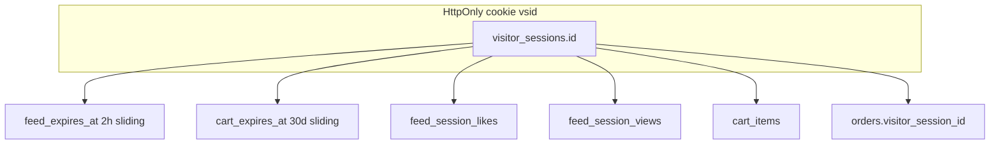

# Backend cart migration (unified visitor session + draft checkout)

## Current state

- **Cart:** client-only Zustand + `localStorage` ([`cart-store.ts`](apps/web/src/hooks/cart/cart-store.ts)).
- **Feed:** anonymous `feed_sessions` + `feed_sid` cookie, single `expires_at` at **2h** — on idle lapse or reshuffle a **new UUID** is minted; likes/views orphaned to old id ([`feed-session.service.ts`](apps/api/src/application/feed/feed-session.service.ts)).
- **Orders:** one-shot create on submit, status `new`.

---

## Unified visitor session (brainstorm → plan)

### Core idea

One **visitor identity** for the whole app — a single UUID with two names depending on layer:

| Layer | Name | Value |
|-------|------|-------|
| HttpOnly cookie | `vsid` | `visitor_sessions.id` |
| Database PK / FKs | `visitor_sessions.id`, `visitor_session_id` | same UUID |

Feed and cart differ only in **feature-specific idle TTLs** (`feed_expires_at`, `cart_expires_at`), not in who the user is.



| Concern | TTL | On idle expire | Visitor id |
|---------|-----|----------------|------------|
| **Feed views** (dedup / recently seen) | 2h sliding (`feed_expires_at`) | **Delete views** — products can appear again; reshuffle = same reset | **always unchanged** |
| **Feed likes** | none (visitor-scoped) | **persist** | unchanged |
| **Cart items** | 30d sliding (`cart_expires_at`) | Clear cart items (lazy on next cart read) | unchanged |
| **Draft orders** | 30d lazy cancel | Auto-`cancelled` | unchanged |
| **Visitor identity (`vsid`)** | **none** | **never rotated** by feed/cart idle | new UUID **only on first visit** (no cookie) |

**Cookie:** rename `feed_sid` → **`vsid`**. Persistent HttpOnly cookie, **not tied to feed/cart TTLs** — survives until the customer clears site data (use a long-lived `maxAge` or equivalent persistent cookie; **do not** slide or expire the cookie based on feed/cart activity). The visitor id is **device-bound identity**, not a sliding session.

**Shared service:** `application/visitor/`

- `VisitorSessionService.resolve(existingId?)` — if `vsid` cookie present and row exists → return it; if cookie absent → create visitor + set cookie. **Never mint a new id because feed or cart idle lapsed.**
- `VisitorSessionService.resolveForFeed(visitor)` — slide `feed_expires_at`; if lapsed → `resetFeedViews(visitor.id)`, refresh feed TTL
- `VisitorSessionService.resolveForCart(visitor)` — slide `cart_expires_at`; if lapsed → clear `cart_items` for visitor, refresh cart TTL
- `VisitorSessionService.resetFeedViews(visitorId)` — delete views only (likes untouched)
- Reshuffle / “start again” → `resetFeedViews` only (not a new visitor)

### Why this is better than two cookies

- **Orders ↔ feed ↔ cart** correlate on one id (`visitor_session_id`) — funnel analytics, “liked then bought”, abandoned checkout recovery.
- Feed keeps its **2h fresh-discovery** behavior without losing **30-day cart** or **persistent likes**.
- Matches your mental model: **visitor id = device identity (permanent)**; `feed_expires_at` / `cart_expires_at` are **feature knobs only** — they reset views or clear cart, they do **not** drive `vsid` rotation or cookie lifetime.

### Schema (migration `1740422404000-VisitorSessionAndCart.ts`)

**Rename / replace `feed_sessions` → `visitor_sessions`:**

```sql
visitor_sessions (
  id              uuid PK,           -- permanent; never rotated for idle
  feed_expires_at timestamptz NOT NULL,  -- feature: when to reset views
  cart_expires_at timestamptz NOT NULL,  -- feature: when to clear cart
  -- timestamps + soft-delete (no visitor-level expires_at)
)
```

**Repoint FKs** (column rename `session_id` → `visitor_session_id`):

- `feed_session_likes`
- `feed_session_views`
- new `cart_items`

**New `cart_items`:** `visitor_session_id`, `product_id`, `qty`, unique `(visitor_session_id, product_id)`

**Alter `orders`:**

- `visitor_session_id` FK → `visitor_sessions` (not `cart_session_id`)
- nullable `customer_name`, `phone` for drafts
- status enum expansion (see below)

**Alter `order_deliveries`:** nullable `city` for drafts

**Data migration:** existing `feed_sessions` rows → `visitor_sessions` with `feed_expires_at = expires_at`, `cart_expires_at = expires_at + 30d` (or `now()+30d`).

### Feed behavior change (breaking vs today, OK pre-prod)

| Action today | Action with unified visitor |
|--------------|----------------------------|
| 2h idle → new `feed_sid` | Same `vsid`; views cleared |
| Reshuffle → new `feed_sid` | Same `vsid`; views cleared |
| Likes after 2h away | Lost (old session id) | **Still visible** (likes on visitor) |

---

## Draft checkout (unchanged intent, visitor-scoped)

**Problem:** Cart clears when checkout begins — need draft recovery.

**Flow:**

1. `POST /orders/draft` — cart → `order_items`, clear cart, status `draft`
2. `/checkout/[orderId]` — load order, blur autosave, submit → `new`
3. Empty cart panel shows `activeDraft` CTA

**Constraints:** one draft per visitor; access control = `order.visitor_session_id` must equal the `vsid` cookie value (same UUID, different names).

### Order statuses

`draft` | `new` | `confirmed` | `arrived` | `completed` | `cancelled` | `returned` | `archived`

MVP storefront transitions: `draft` → `new` (submit) | `cancelled` (user dismiss or replaced by new draft). Telegram on submit only.

**User-initiated draft cancel (in scope):**

- **API:** `DELETE /orders/:id/cancel` — dedicated cancel action with status guardrails (see below).
- **UI:** cart panel **unfinished draft row** — summary + link to resume checkout + **close/cross icon** → cancel.
- **Hook:** `useCancelDraftOrder()` → `DELETE /orders/:id/cancel`, then invalidate `cart` query (clears `activeDraft`).
- **After cancel:** draft row disappears; **items stay on the cancelled order** (not restored to cart in MVP — see optional follow-up).

---

## Target architecture

```mermaid
sequenceDiagram
    participant UI as Web_UI
    participant API as NestJS
    participant DB as Postgres

    Note over UI,DB: Same vsid cookie for feed, cart, orders

    UI->>API: POST /feed/next (vsid)
    API->>DB: slide feed_expires_at; maybe DELETE views

    UI->>API: POST /cart/items (vsid)
    API->>DB: slide cart_expires_at; upsert cart_items

    UI->>API: POST /orders/draft (vsid)
    API->>DB: cart_items → order_items; order.visitor_session_id = visitor.id

    UI->>API: GET /cart
    API-->>UI: items + activeDraft for this visitor
```

---

## Phase 1 — Visitor session + cart module

### Visitor module [`application/visitor/`](apps/api/src/application/visitor/)

- `visitor-session.entity.ts`, `visitor-session.cookie.ts` (`vsid`, persistent cookie, feed/cart TTL constants)
- `VisitorSessionService` — `resolve()` (first visit only creates id) + `resolveForFeed` / `resolveForCart` + `resetFeedViews`
- Refactor [`FeedSessionService`](apps/api/src/application/feed/feed-session.service.ts) → thin wrapper or merge into visitor service; feed controller uses `resolveForFeed`
- Update [`feed.controller.ts`](apps/api/src/application/feed/feed.controller.ts) `resolveSession`: reshuffle calls `resetFeedViews`, not `createFreshSession`

### Cart module [`application/cart/`](apps/api/src/application/cart/)

Uses `VisitorSessionService.resolveForCart` in controller.

| Method | Path | Slides TTL |
|--------|------|------------|
| `GET` | `/cart` | `cart_expires_at` |
| `POST` | `/cart/items` | cart |
| `PATCH` | `/cart/items/:productId` | cart |
| `DELETE` | `/cart/items/:productId` | cart |
| `DELETE` | `/cart` | cart |

`CartResponseDto`: `{ items, totalMinor, itemCount, currency, activeDraft? }`

---

## Phase 2 — Draft checkout API

| Method | Path | Purpose |
|--------|------|---------|
| `POST` | `/orders/draft` | Begin checkout (visitor-scoped) |
| `GET` | `/orders/:id` | Checkout view + prefill |
| `PATCH` | `/orders/:id` | Blur autosave |
| `POST` | `/orders/:id/submit` | `draft` → `new` |
| `DELETE` | `/orders/:id/cancel` | Cancel order — status guardrails enforced |

### `DELETE /orders/:id/cancel` — dedicated cancel endpoint

Centralizes **when** `→ cancelled` is allowed. Storefront MVP rules:

| Current status | Allowed? | Response |
|----------------|----------|----------|
| `draft` | **Yes** (if `visitor_session_id === vsid`) | `200` + order with `cancelled` |
| `cancelled` | **Yes** (idempotent) | `200` + order (already cancelled) |
| `new`, `confirmed`, `arrived`, `completed`, `returned`, `archived` | **No** | `409 Conflict` — `OrderCancelNotAllowedException` |

**Checks (in order):**

1. Order exists and `visitor_session_id === vsid` — else `404`.
2. If `status === cancelled` → return as-is (idempotent).
3. If `status === draft` → set `cancelled`, return.
4. Any other status → `409` with clear message (customer cannot cancel after submit).

**Internal reuse:** `POST /orders/draft` calls the same `OrdersService.cancelDraft(visitorId)` helper to cancel a prior draft (replace flow) — not a second code path.

Do **not** use generic `DELETE /orders/:id` (delete-as-cancel is ambiguous vs hard delete).

Remove legacy `POST /orders` single-shot create.

---

## Phase 3 — Frontend

- Single cookie already works via `credentials: 'include'` — no client-side cookie name usage today
- `api/cart/`, extended `api/orders/` — include `useCancelDraftOrder`
- **Cart panel — draft row** ([`cart-panel.tsx`](apps/web/src/components/cart/cart-panel.tsx)):
  - Render when `activeDraft` from `GET /cart` (typically cart empty → above [`CartEmptyState`](apps/web/src/components/cart/cart-empty-state.tsx), or banner when cart also has items).
  - Row shows: item count, total, **“Continue checkout”** link → `/checkout/[orderId]`, **IconButton with close icon** → `useCancelDraftOrder(orderId)` with `aria-label` from i18n.
  - On cancel success: invalidate cart query; panel shows empty state if no cart lines.
- **Delete** [`checkout/page.tsx`](apps/web/src/app/[locale]/checkout/page.tsx); **add** `checkout/[orderId]/page.tsx`
- Checkout blur autosave; Zustand panel-only
- i18n: `cart.draft.continue`, `cart.draft.cancel`, `cart.draft.summary` (uk + en)

---

## Phase 4 — Tests

- Visitor: feed idle → same id, views cleared, likes remain
- Reshuffle → views cleared, same id
- Cart idle 30d → cart items cleared, **same visitor id**
- First visit (no cookie) → new visitor id + set persistent `vsid`
- Cross-feature: like in feed → add to cart → draft order shares `visitor_session_id`
- Update [`~feed-session.service.test.ts`](apps/api/src/tests/application/~feed-session.service.test.ts) → visitor session tests
- Draft cancel: `DELETE /orders/:id/cancel` → `cancelled`; `409` after submit; wrong visitor `404`
- E2E: open cart → cancel draft via × → draft row gone

---

## Open questions resolved

| Question | Decision |
|----------|----------|
| One or two cookies? | **One** (`vsid`) |
| Visitor id lifetime | **Permanent per device** — no server-side expiry; new id only when cookie absent (first visit) |
| Feed idle behavior | **Forget views only**; likes persist on visitor |
| Reshuffle | Same as feed idle reset (views), **not** new visitor id |
| Cart vs feed lifetime | `feed_expires_at` / `cart_expires_at` — feature-only; **do not** affect `vsid` |
| Order linkage | `orders.visitor_session_id` |

## Still optional later

- Restore cancelled draft → cart
- Admin status transitions UI
- Price-change warning on draft submit

---

## Files touched (summary)

**New:** `application/visitor/*`, `application/cart/*`, migrations, tests

**Modified:** feed module (cookie name, session resolve, reshuffle), orders/*, `runtime.config.ts` comment, frontend cart/checkout/e2e

**Deleted (frontend):** `app/[locale]/checkout/page.tsx`

**Renamed concepts:** `feed_sid` → `vsid` (cookie only), `feed_sessions` → `visitor_sessions`, FK column `session_id` → `visitor_session_id` — all hold the **same UUID**
