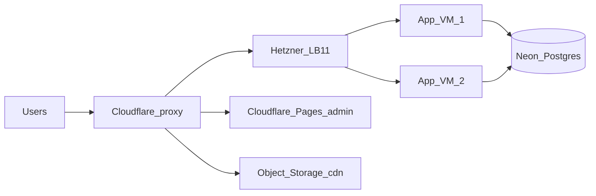

# DevOps — production HA (local + prod)

**Topology:** Cloudflare → **Hetzner LB11** → **2× app VMs** (each: Caddy + web + api) + **Neon Postgres EU** + **Cloudflare Pages** (admin) + **Hetzner Object Storage** (`cdn.`). No staging env. No K8s.

Rough fixed cost ~€30–45/mo (2× CX33 + LB11 + Object Storage + Neon idle).

| Hostname                 | Target                        |
| ------------------------ | ----------------------------- |
| `mynoodles.shop` / `www` | CF → **LB** → Caddy → **web** |
| `api.mynoodles.shop`     | CF → **LB** → Caddy → **api** |
| `admin.mynoodles.shop`   | **Cloudflare Pages**          |
| `cdn.mynoodles.shop`     | CF → Hetzner Object Storage   |



## Layout

```text
devops/
  README.md           # this index
  tofu/               # OpenTofu modules + envs/prod (see tofu/README.md)
  compose/            # production Compose (caddy + web + api) — identical on each VM
  caddy/              # Origin CA TLS reverse proxy config
  scripts/            # bootstrap-host.sh, rolling-compose-deploy.sh
  docs/               # runbooks (below)
```

## GitHub Actions

| Workflow           | Path                                                                              | Trigger                    | What it does                                                         |
| ------------------ | --------------------------------------------------------------------------------- | -------------------------- | -------------------------------------------------------------------- |
| **CI**             | [`.github/workflows/ci.yml`](../.github/workflows/ci.yml)                         | PR + `main`                | Quality gate (`nx affected`). Does **not** deploy.                   |
| **tofu**           | [`.github/workflows/tofu.yml`](../.github/workflows/tofu.yml)                     | `workflow_dispatch`        | OpenTofu plan/apply · `envs/prod` · calls bootstrap-host after apply |
| **bootstrap-host** | [`.github/workflows/bootstrap-host.yml`](../.github/workflows/bootstrap-host.yml) | `workflow_call` + dispatch | Sync compose / Origin CA / `.env` on **all** app VMs                 |
| **deploy-web**     | [`.github/workflows/deploy-web.yml`](../.github/workflows/deploy-web.yml)         | `workflow_dispatch`        | build → GHCR → rolling `compose up --wait` web                       |
| **deploy-api**     | [`.github/workflows/deploy-api.yml`](../.github/workflows/deploy-api.yml)         | `workflow_dispatch`        | migrate → GHCR → rolling `compose up --wait` api                     |
| **deploy-admin**   | [`.github/workflows/deploy-admin.yml`](../.github/workflows/deploy-admin.yml)     | `workflow_dispatch`        | admin → Cloudflare Pages                                             |

Nothing auto-deploys or auto-applies infra from `main`.

### App deploy

1. Open PR → **CI** must pass.
2. Merge to `main` (or pick any commit).
3. Actions → `deploy-web` / `deploy-api` / `deploy-admin` → **Run workflow**.
4. Input **`ref`**: branch or git SHA (**without** `sha-` prefix).
5. Hosts come from tofu `app_ipv4` (rolling: VM1 then VM2). Images: `ghcr.io/<owner>/my-noodles-{web,api}:sha-<short>`.

### Infra (OpenTofu)

1. One-time encrypted state bootstrap — [docs/state-backend.md](./docs/state-backend.md).
2. Fill Environment `prod` — [docs/secrets.md](./docs/secrets.md).
3. `pnpm tofu:plan` → review → `pnpm tofu:apply` (or Actions → **tofu**).
4. After apply, **bootstrap-host** syncs every app VM. Re-run: `pnpm bootstrap:host`.
5. **Never** `tofu apply` prod from a laptop — [tofu/README.md](./tofu/README.md).

### Image tags

| Concept        | Format                  | Example           |
| -------------- | ----------------------- | ----------------- |
| Workflow `ref` | branch or git SHA       | `main`, `a1b2c3d` |
| GHCR tag       | `sha-<short>` (7 chars) | `sha-a1b2c3d`     |

Admin has no Docker image — static `dist/` on Cloudflare Pages.

### Rollback

Re-run the same deploy workflow with `ref=<previous-good-sha>`. See [docs/rollback.md](./docs/rollback.md).

## Runbooks

| Doc                                                | Topic                                      |
| -------------------------------------------------- | ------------------------------------------ |
| [tofu/README.md](./tofu/README.md)                 | Modules, envs, CI-only apply, pnpm scripts |
| [docs/state-backend.md](./docs/state-backend.md)   | Encrypted local state in git               |
| [docs/secrets.md](./docs/secrets.md)               | GH Environment `prod` secrets / vars       |
| [docs/neon.md](./docs/neon.md)                     | Neon IaC, wiring, scale-to-zero, PITR      |
| [docs/edge.md](./docs/edge.md)                     | Cloudflare DNS → LB, Pages, `cdn.`         |
| [docs/origin-ca.md](./docs/origin-ca.md)           | Full (strict) + Origin CA (edge TLS)       |
| [docs/object-storage.md](./docs/object-storage.md) | Hetzner Object Storage bucket / prefixes   |
| [docs/dns-namecheap.md](./docs/dns-namecheap.md)   | Namecheap NS → Cloudflare                  |
| [docs/rollback.md](./docs/rollback.md)             | SHA rollback + migrations                  |
| [docs/observability.md](./docs/observability.md)   | Grafana Cloud OTLP + Sentry errors         |
