# ADR: Application Infrastructure on Cloudflare

**Status:** Accepted
**Date:** 2026-08-17
**Scope:** Application infrastructure, deployment, networking, storage, and database

## Context

The application is a small public web application with intentionally low initial traffic.

Expected initial usage:

* approximately **5 users/day**
* approximately **15 minutes of activity per user**
* public deployment
* potentially unpredictable traffic growth
* up to approximately **100 products**
* each product may have approximately **1–4 photos**
* a server-backed **Next.js frontend requiring SSR**
* a separate **simple SPA frontend**
* a **NestJS monolithic API**
* a relational **PostgreSQL database**
* object storage for product photos and other potentially large files

The infrastructure should:

* minimize operational overhead
* have low initial cost
* provide adequate limits for the expected workload
* tolerate reasonable traffic growth
* use one primary infrastructure ecosystem where practical
* provide clear usage and cost metrics
* allow future infrastructure decisions to be based on real production data rather than hypothetical scale

The application domain has already been purchased through **Namecheap**. 

---

# Decision

Use **Cloudflare as the primary application infrastructure platform**, with **Neon PostgreSQL** as the managed PostgreSQL database.

The resulting infrastructure is:

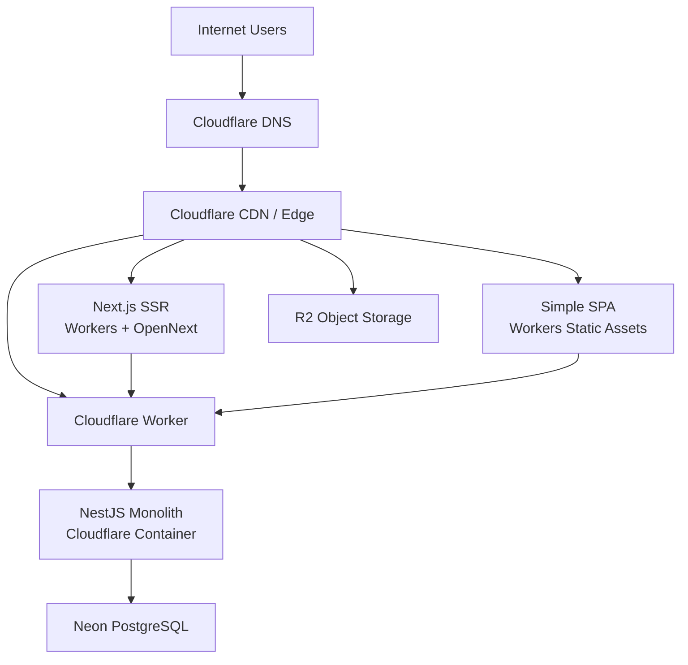

**Important:** R2 is intentionally **not accessed by the NestJS Container** in the current architecture.

R2 is used as an object origin for publicly served files:

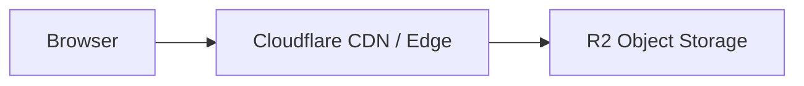

The NestJS API manages application metadata in PostgreSQL, while the actual product image bytes are served separately through Cloudflare's edge/CDN.

The architecture consists of:

| Responsibility        | Technology                      |
| --------------------- | ------------------------------- |
| Domain registration   | Namecheap                       |
| DNS                   | Cloudflare DNS                  |
| CDN / edge network    | Cloudflare                      |
| SSR frontend          | Next.js + OpenNext on Workers   |
| Simple SPA            | Workers Static Assets           |
| API                   | NestJS on Cloudflare Containers |
| Relational database   | Neon PostgreSQL                 |
| Object storage        | Cloudflare R2                   |
| Baseline compute plan | Workers Paid                    |

---

# Frontend: Next.js SSR

The server-backed frontend will use **Next.js deployed to Cloudflare Workers through the OpenNext adapter**.

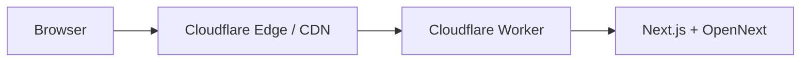

This is the frontend that requires server-side functionality such as:

* SSR
* App Router
* React Server Components
* Route Handlers
* Server Actions
* streaming
* other functionality supported by the OpenNext adapter

The application will therefore treat this frontend as a **server-backed application**, rather than a static website.

---

# Frontend: Simple SPA

The simple SPA frontend will use **Workers Static Assets**.

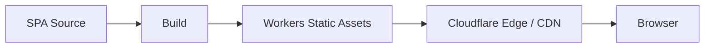

Workers Static Assets are preferred for application assets because they are served through Cloudflare's infrastructure without requiring the application to execute Worker code for every static asset request.

Static asset requests are free and do not consume the normal Worker request allowance.

This makes Workers Static Assets the preferred location for:

* HTML
* JavaScript bundles
* CSS
* fonts
* icons
* logos
* small static images
* other deployment-time frontend assets

---

# Object storage: R2

**Cloudflare R2** will be used for persistent application objects.

Examples include:

* product photos
* user uploads
* large downloads
* PDFs
* videos
* other application-generated files

However, in the current architecture **the NestJS API does not access R2**.

R2 is currently treated as an origin for objects that are directly delivered through Cloudflare's edge/CDN:

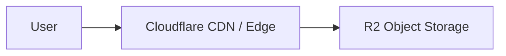

This means product image delivery does not pass through the NestJS application:

```text
Browser
   ↓
Cloudflare CDN
   ↓
R2
```

rather than:

```text
Browser
   ↓
NestJS
   ↓
R2
   ↓
NestJS
   ↓
Browser
```

This keeps large file delivery separate from API compute.

---

# Small files vs. R2

The infrastructure deliberately uses both **Workers Static Assets** and **R2**.

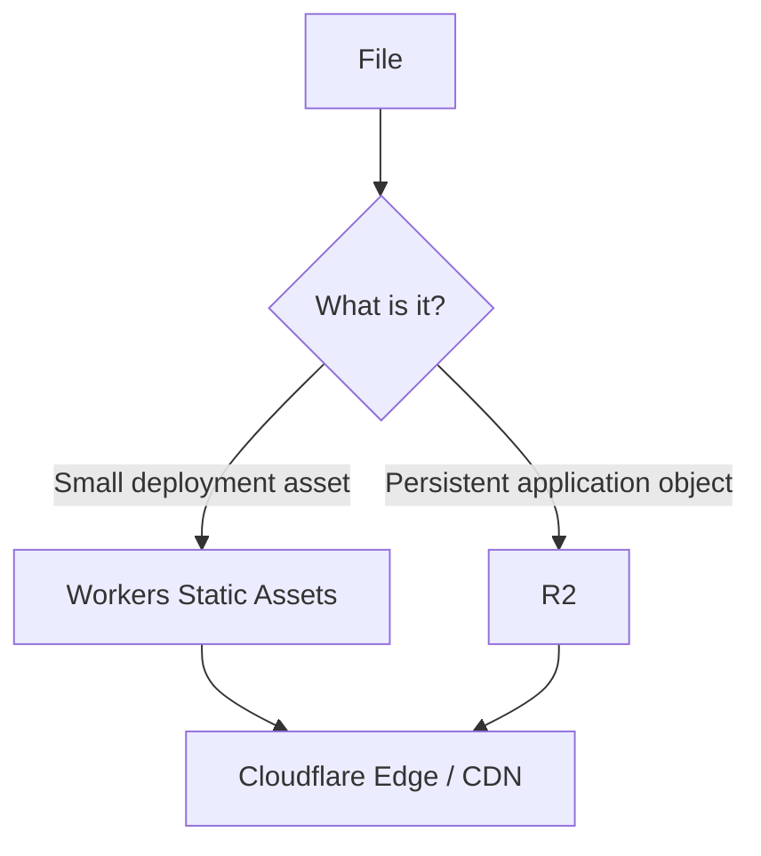

Workers Static Assets have a current **25 MiB maximum individual file size**.

Therefore:

* small deployment assets → **Workers Static Assets**
* large/persistent application objects → **R2**

Workers Static Assets are preferred for small deployment files because their serving and storage do not incur additional R2 charges.

R2 is preferred for product photos even when individual photos are small because product photos are **application data** that can change independently of application deployments.

---

# Product photos

The application will initially support up to approximately **100 products**.

Each product can have approximately **1–4 photos**.

The theoretical initial maximum is:

```text
100 products × 4 photos
= 400 product photos
```

Product photos will be stored in R2.

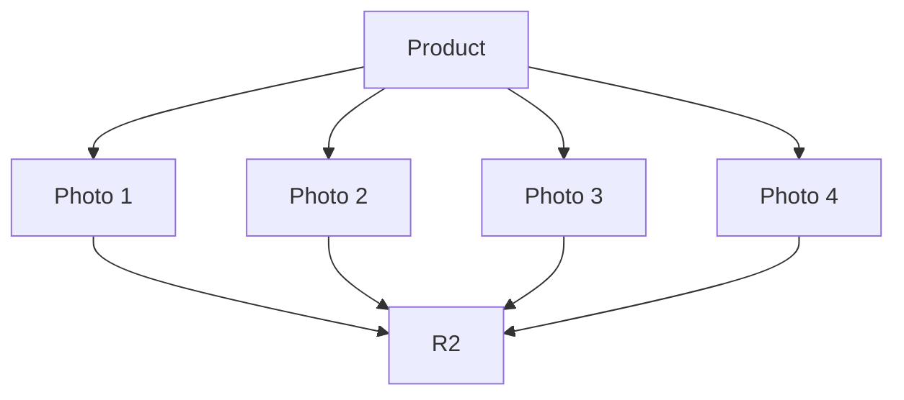

The number of photos per product is variable; some products may have one photo while others may have several.

The product metadata remains in PostgreSQL:

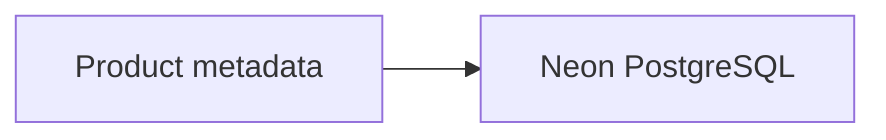

The database can therefore contain references to product images without storing the image bytes itself.

---

# CDN

Cloudflare's edge network will serve as the application's **CDN**.

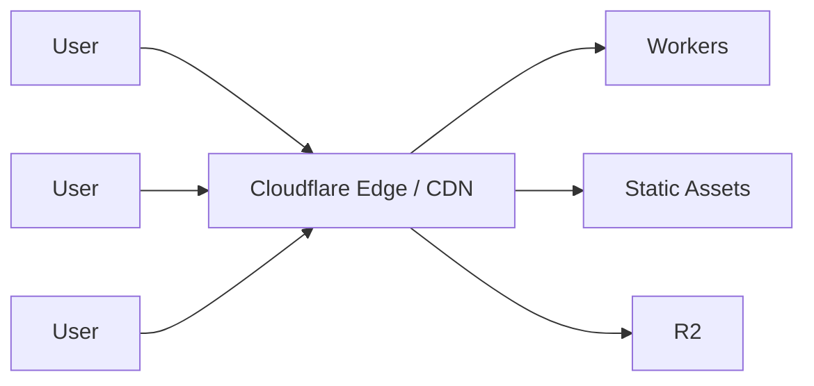

No separate CDN provider will be introduced initially.

The Cloudflare edge network will handle delivery of appropriate:

* Worker responses
* static assets
* cached content
* R2 objects

This keeps CDN configuration within the same ecosystem as the application runtime.

---

# Backend: NestJS API

The backend will be implemented as a **NestJS monolithic API running in a Cloudflare Container**.

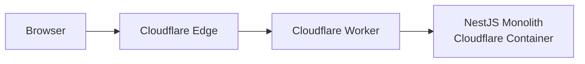

The Container provides a conventional Node.js environment for NestJS.

This avoids requiring the monolithic API to be adapted to the Workers runtime.

The Container is responsible for:

* NestJS
* Node.js runtime
* API business logic
* database access
* other backend operations requiring a conventional Node.js environment

**R2 is deliberately excluded from this list.** The current application does not require the NestJS API to read or write product objects in R2.

---

# Database: Neon PostgreSQL

**Neon PostgreSQL** will be used as the application's relational database.

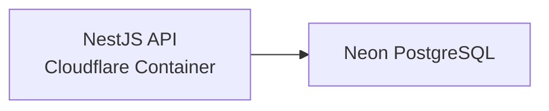

The database is intentionally kept separate from Cloudflare's application infrastructure.

```text
Cloudflare
├── DNS
├── CDN
├── Workers
├── Containers
└── R2

Neon
└── PostgreSQL
```

The NestJS API is the primary database client.

Frontend applications communicate with the API rather than directly accessing PostgreSQL.

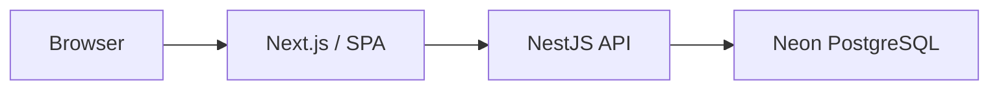

This keeps:

* database credentials
* database access logic
* authorization
* business rules

on the server side.

Using standard PostgreSQL also keeps the relational database layer relatively independent of Cloudflare-specific database technology.

---

# DNS

The domain is registered with **Namecheap**.

**Cloudflare DNS** will be used as the authoritative DNS service.

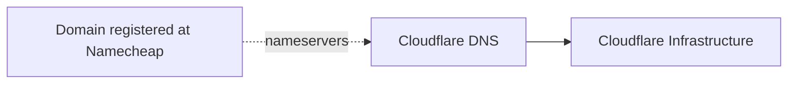

Namecheap remains the registrar.

Cloudflare becomes the DNS provider by configuring the domain's nameservers at Namecheap.

This provides integration with:

* custom domains
* Cloudflare CDN
* Workers
* TLS
* traffic management
* Cloudflare security features

---

# Pricing

The following represents the **expected monthly infrastructure cost at the initial workload**, rather than a guaranteed bill.

The Cloudflare Workers Paid plan has a **$5/month minimum** and includes the relevant Workers and initial Container allowances. Current R2 pricing includes **10 GB-month storage, 1M Class A operations, and 10M Class B operations per month** at no charge; Internet egress is free. ([Cloudflare Docs][1])

Neon currently provides a Free plan with **50 CU-hours/month and 0.5 GB storage per project**, while its paid plans use usage-based pricing without a monthly minimum. ([Neon][2])

### Expected initial monthly cost

| Component               | Expected initial usage                          | Expected monthly cost |
| ----------------------- | ----------------------------------------------- | --------------------: |
| Cloudflare Workers Paid | Base plan                                       |             **$5.00** |
| Workers / OpenNext      | Low traffic, within allowance                   |     **$0** additional |
| Workers Static Assets   | Small SPA                                       |                **$0** |
| Cloudflare CDN          | Included                                        |     **$0** additional |
| Cloudflare Containers   | Low traffic; expected within included allowance |    **$0** additional* |
| R2 storage              | Likely below 10 GB initially                    |                **$0** |
| R2 operations           | Low product-image traffic                       |                **$0** |
| R2 egress               | Product-image delivery                          |                **$0** |
| Neon PostgreSQL         | Within Free plan allowance                      |                **$0** |
| Namecheap domain        | Already purchased                               |     **$0 additional** |
| **Expected total**      |                                                 |        **≈ $5/month** |

* Actual Container consumption depends on the selected container resources and runtime behavior.

R2's current Standard pricing after the free allowance is **$0.015/GB-month**, **$4.50/million Class A operations**, and **$0.36/million Class B operations**, with no Internet egress charge. ([Cloudflare Docs][3])

### Possible growth scenario

The purpose of the architecture is not to guarantee a fixed $5 bill forever. The expected model is:

```text
Initial
≈ $5/month
   │
   ├── Workers Paid
   ├── Neon Free
   └── R2 Free allowance
          │
          ▼
Growth
$5 + actual Cloudflare usage
  + actual R2 usage
  + actual Neon usage
          │
          ▼
Higher traffic
Measured infrastructure cost
          │
          ▼
Data-driven architecture decision
```

This is preferable to choosing a larger fixed infrastructure configuration before the application's actual usage is known.

---

# Expected initial workload

Expected user activity:

```text
5 users/day
× 15 minutes/user
= 75 user-minutes/day

75 × 30 days
≈ 2,250 user-minutes/month
≈ 37.5 user-hours/month
```

This is considered a **very low initial workload**.

User activity time is not equivalent to CPU consumption. A request-driven Node.js API can spend much of its time waiting for:

* network requests
* database operations
* user requests
* other I/O

rather than continuously consuming CPU.

Cloudflare Containers use resource-based billing, so actual CPU consumption is more relevant than simply counting user minutes.

The Container can also sleep when idle, making a usage-based runtime suitable for a low-traffic public application.

---

# Financial rationale

A small Hetzner VM could potentially provide more raw compute for a similar fixed monthly cost.

However, the objective is not to minimize the infrastructure bill at all costs.

The objective is to minimize the **total cost of operating and managing the application**.

The selected architecture provides:

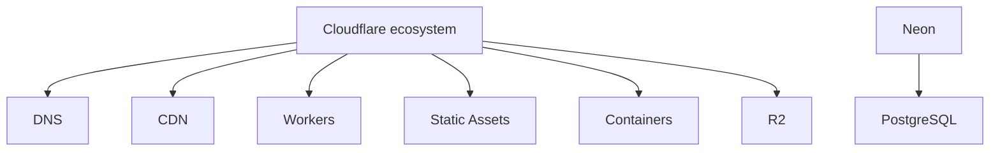

Instead of separately managing:

```text
DNS provider
+
CDN
+
frontend host
+
SSR platform
+
API server
+
container infrastructure
+
object storage
+
database server
```

most application infrastructure is managed through Cloudflare, while PostgreSQL is delegated to a specialized managed PostgreSQL provider.

The additional cost, if any, is therefore accepted in exchange for reduced infrastructure management.

---

# Management rationale

The architecture intentionally separates concerns while keeping infrastructure operationally simple.

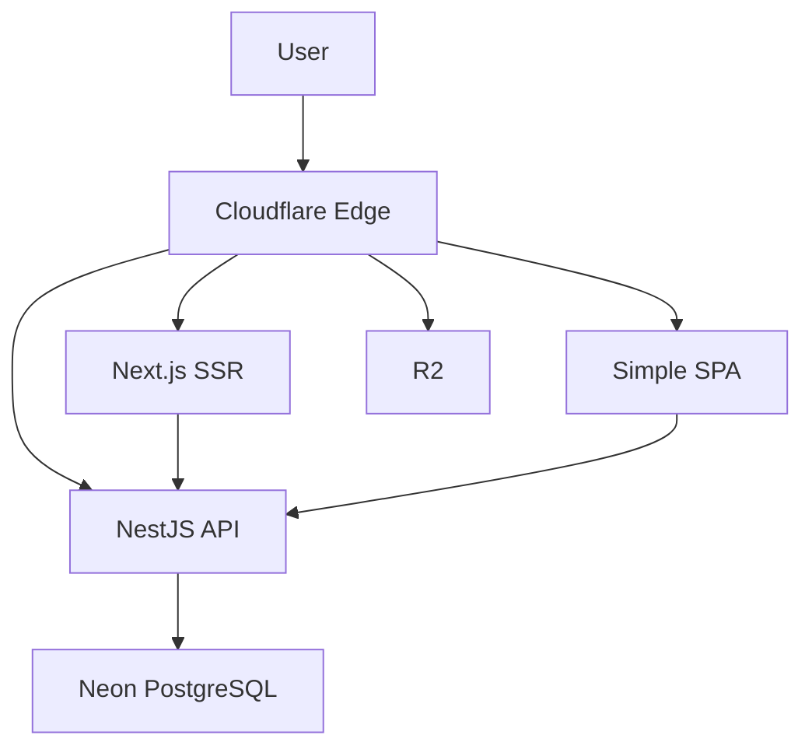

Each technology has a clear responsibility:

| Responsibility      | Technology            |
| ------------------- | --------------------- |
| Domain registration | Namecheap             |
| DNS                 | Cloudflare DNS        |
| Edge/CDN            | Cloudflare            |
| SSR frontend        | Workers + OpenNext    |
| Static SPA          | Workers Static Assets |
| Backend             | Containers + NestJS   |
| Object storage      | R2                    |
| Relational database | Neon PostgreSQL       |

This reduces the need to:

* operate servers
* configure operating systems
* maintain Docker hosts
* manage load balancers
* operate a dedicated CDN
* build infrastructure before actual requirements are known

---

# Data-driven scaling strategy

The initial infrastructure deliberately favors **measurement over premature optimization**.

Production usage will be monitored to determine:

* Worker requests
* Worker CPU consumption
* Container CPU consumption
* Container memory consumption
* Container runtime
* R2 storage
* R2 operations
* Neon database usage
* traffic volume
* CDN/cache behavior
* total monthly infrastructure cost

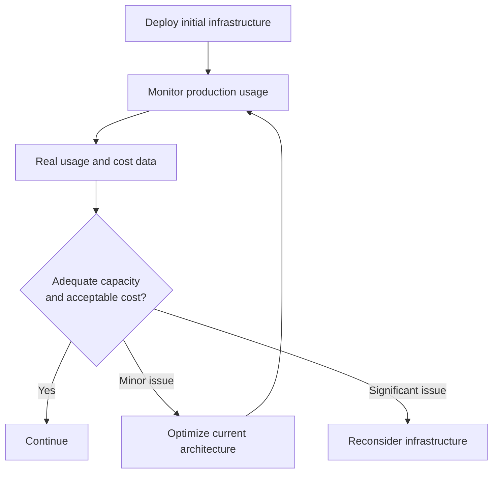

The project will therefore **not introduce additional infrastructure simply because the application might eventually become large**.

Real production data will determine when architectural changes are justified.

---

# Alternatives considered

## Hetzner VM

A Hetzner VM was considered for the NestJS API.

### Advantages

* very low fixed cost
* excellent price/performance
* full Linux environment
* root access
* unrestricted Docker usage
* large amount of resources relative to this application's requirements

### Disadvantages

* continuously running
* operating system maintenance
* security updates
* monitoring responsibility
* deployment management
* scaling infrastructure
* separate infrastructure ecosystem

**Decision:** Rejected initially.

Hetzner remains a valid future alternative if actual production usage demonstrates that a dedicated VM provides a substantially better cost/performance ratio.

---

## Vercel for Next.js

Vercel was considered for the Next.js frontend.

### Advantages

* native Next.js ecosystem
* mature Next.js deployment platform
* strong framework integration

### Disadvantages

* introduces another infrastructure provider
* separates frontend infrastructure from backend infrastructure
* reduces the value of having a single Cloudflare-based application platform

**Decision:** Rejected in favor of Cloudflare Workers + OpenNext.

---

## D1 for the database

Cloudflare D1 was considered as the relational database.

### Advantages

* integrated with Cloudflare
* SQLite-based
* simple deployment
* low operational overhead

### Disadvantages

* application requires conventional PostgreSQL
* Neon provides a managed PostgreSQL environment
* PostgreSQL keeps the database layer more portable
* existing PostgreSQL ecosystem and tooling are preferred

**Decision:** Rejected in favor of Neon PostgreSQL.

---

# Consequences

## Positive

* **One primary application infrastructure ecosystem**
* Low initial infrastructure cost
* Low operational overhead
* Next.js SSR supported through OpenNext
* Simple SPA served directly through Workers Static Assets
* Static assets can be served without additional R2 cost
* R2 provides appropriate storage for persistent/large files
* Product photos are separated from application deployment assets
* R2 delivery does not consume NestJS compute
* Cloudflare provides CDN/edge delivery
* NestJS can remain a conventional Node.js application
* Neon provides conventional PostgreSQL
* Infrastructure limits are substantially above the expected initial workload
* Production usage can be measured before making future infrastructure decisions
* No need to maintain a VM at the beginning

## Negative

* Dependence on Cloudflare for application infrastructure
* Next.js runs through OpenNext rather than Vercel's native platform
* Cloudflare Containers have per-instance resource limits
* Cloudflare-specific deployment knowledge is required
* R2 and Container usage introduce usage-based billing
* Neon introduces a second infrastructure provider
* A dedicated VM may eventually become more economical for a continuously active workload
* Migration away from Cloudflare may require removing Cloudflare-specific integrations

---

# Future reassessment criteria

The architecture should be reassessed when real production data demonstrates one or more of the following:

* Container resource limits are being approached
* Container costs become significant
* Worker limits become restrictive
* R2 storage or operation costs become significant
* Neon costs become significant
* Next.js/OpenNext compatibility creates practical limitations
* the application requires infrastructure capabilities unavailable on Cloudflare
* a permanently active workload makes a dedicated VM substantially more economical
* operational requirements justify splitting the monolith

Until such evidence exists, the selected architecture should remain unchanged.

---

# Final decision

The application will use:

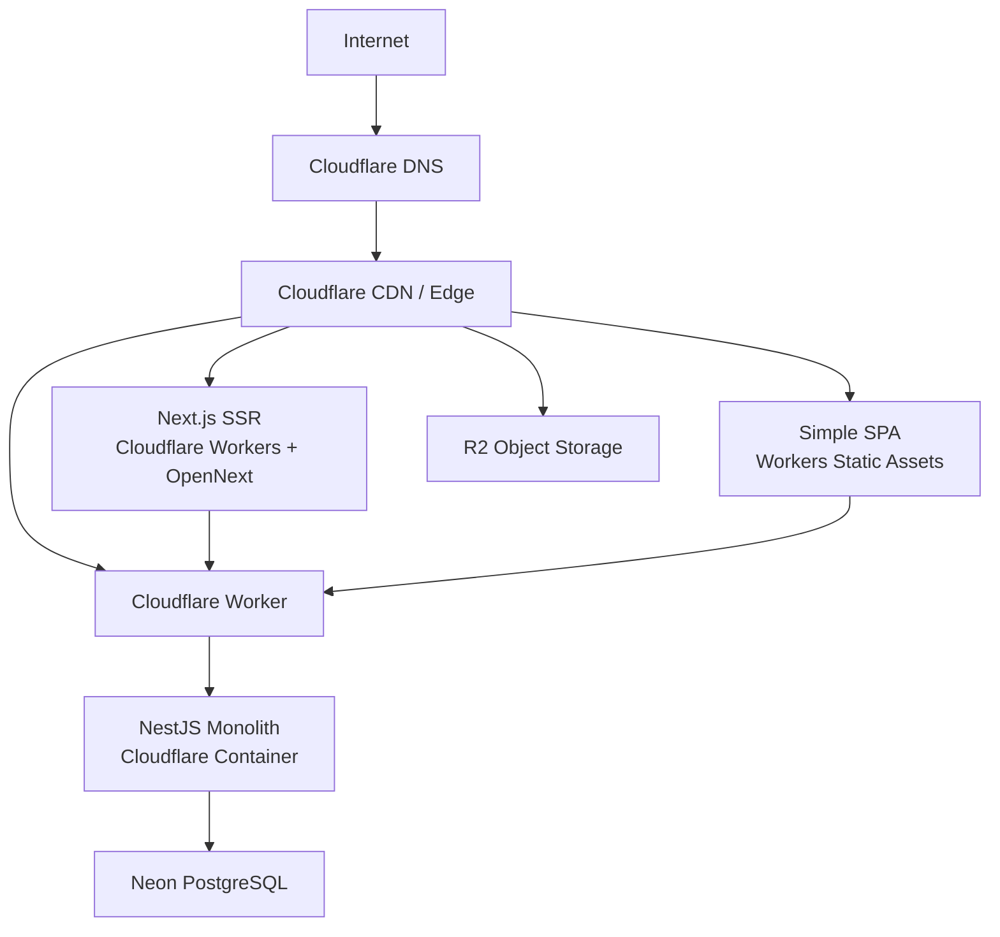

**Selected infrastructure:**

* **Cloudflare DNS** — custom domain DNS
* **Cloudflare CDN/Edge** — content delivery
* **Cloudflare Workers + OpenNext** — server-backed Next.js frontend
* **Workers Static Assets** — simple SPA and small static deployment assets
* **Cloudflare Containers** — NestJS monolithic API
* **Cloudflare R2** — product photos and other large/persistent objects, served through the Cloudflare edge
* **Neon PostgreSQL** — relational database
* **Workers Paid** — baseline Cloudflare compute plan

**R2 is intentionally not a dependency of the NestJS Container in the initial architecture.**

The guiding principle is:

> **Start with one primarily managed ecosystem that is comfortably sufficient for the expected workload, accept a small predictable baseline cost, collect real production usage data, and only introduce additional infrastructure complexity when actual data demonstrates that it is necessary.**

[1]: https://developers.cloudflare.com/workers/platform/pricing/?utm_source=chatgpt.com "Pricing · Cloudflare Workers docs"
[2]: https://neon.com/blog/new-usage-based-pricing?a=b51acb5c-d88f-4d95-b533-36b729ea05a1&utm_source=chatgpt.com "Neon’s New Pricing, Explained: Usage-Based, No Minimum - Neon"
[3]: https://developers.cloudflare.com/r2/pricing/?utm_source=chatgpt.com "Pricing · Cloudflare R2 docs"
