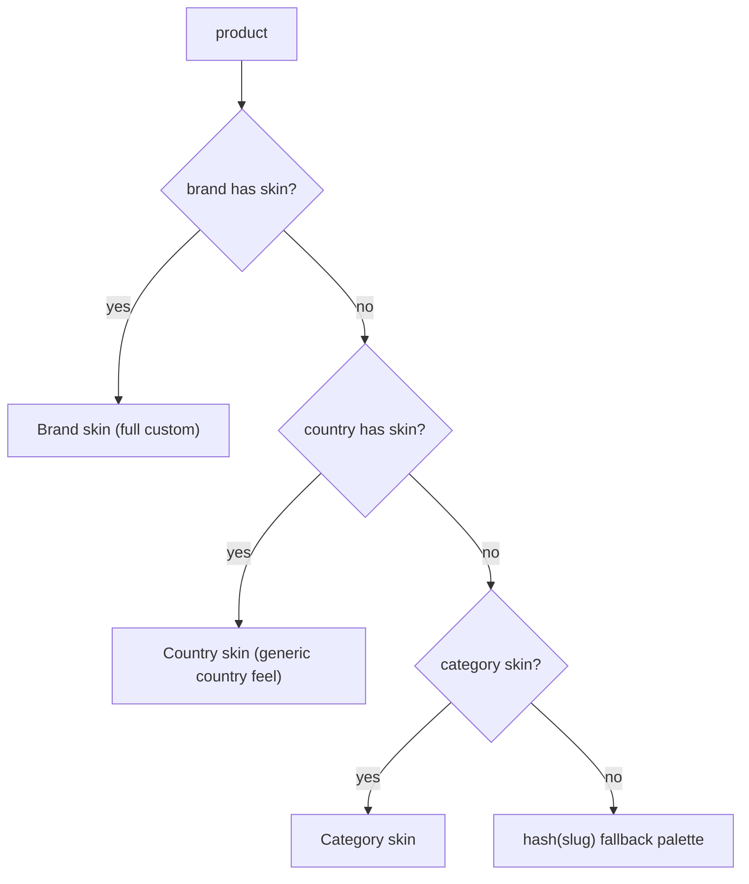
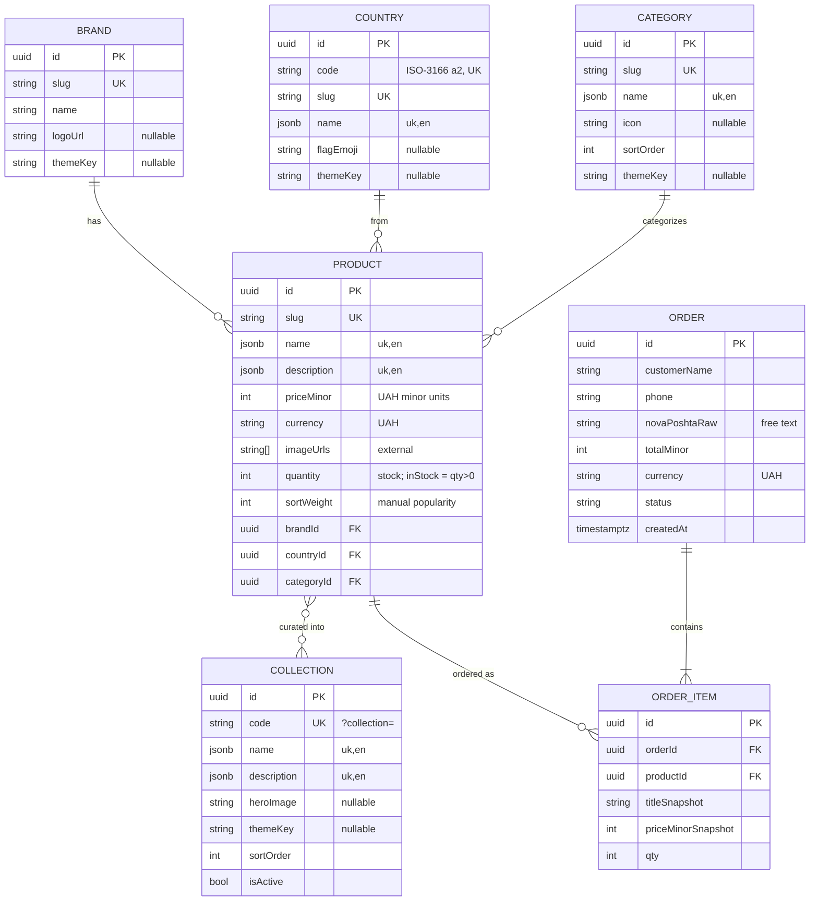

# MVP Food-Import Site

Mobile-first, SEO-optimized full-stack MVP for the food-discovery store. Nx monorepo: Next.js (App Router, ISR) + MUI design system (dedicated theme package) + React Query + typed OpenAPI client, and NestJS + TypeORM + Postgres backend. Goal is behavioral data via a slick catalog, honest product cards, curated Collections, and a cart->checkout funnel. Orders persist in DB + fire a Telegram notification. Layered brand/country theming skins. Ukrainian now, i18n-ready. Deploy/infra out of scope.

## Resolved decisions (from grill)

- **Rendering/fetching**: Server Components fetch via the generated axios client + **ISR** (`revalidate`), prefetch into React Query `HydrationBoundary`; client hooks only for filters/cart. Generated `typescript-axios` client must run in both Node and browser.
- **i18n**: Ukrainian shipped, structure i18n-ready. UI strings via **next-intl** with `localePrefix: 'always'` — every locale is prefixed (`/uk/...` now, `/en/...` later) for consistent, maintainable routing; root `/` redirects to `/uk` and middleware sets the canonical/`hreflang`. (Chosen over `as-needed` deliberately: one URL shape for all locales, no special-casing the default, matches competitors' `/ua/`.) Messages in per-locale JSON (no magic strings). DB content via **JSONB localized columns** (`name: {uk, en}`); backend resolves field by `?locale`.
- **Cart**: **Zustand + persist** (localStorage), client-side; `Order` created only on checkout submit. Cart store has `version` + `migrate` that **drops the stored cart on version bump**.
- **Checkout**: free-text city + branch/address; manager confirms via Telegram.
- **Images**: product photos = **external URLs in DB** (`next/image` `remotePatterns`); UI assets committed beside code.
- **Dev DB**: **docker-compose Postgres** (matches prod, `jsonb` works). Schema is **migrations-only** — `ormconfig` sets `synchronize: false` always (even in dev), so the DB never silently drifts from migrations.
- **Analytics**: **GTM-only, client-only** (GA4 as a GTM tag; **GA4-only** — Meta Pixel dropped, can be added later as a GTM tag with no code change), app pushes clean `dataLayer`; via `@next/third-parties`. **Consent Mode v2** + banner. **No server-side analytics storage** for now.
- **Order comms**: no auto-emails; on-screen success + **Telegram bot notification** to the owner, who processes orders directly in Telegram. No admin/management UI, **no PWA/Web Push** this stage. No newsletter/email capture.
- **Endpoint protection**: NestJS **Throttler** (global ~60 req/min per IP; `POST /api/orders` tighter at ~5/min per IP) + class-validator DTOs + form **honeypot** (hidden `company` field — reject if filled); no CAPTCHA.
- **Transitions**: **native View Transitions** via React `<ViewTransition>` + Next 16 `experimental.viewTransition` (no third-party lib). Patterns per the official Next guide: shared-element **morph** (catalog card image -> product hero via matching `name`), **Suspense reveals** for loading skeletons (`enter`/`exit`), **directional slides** via `Link`/`useRouter` `transitionTypes` (`nav-forward`/`nav-back`, header anchored), same-route **crossfade** (`key` + `share/enter="auto"`) for tab/facet swaps. `motion` for micro-interactions. Rationale: transitions are progressive enhancement (no-op without browser support), so the experimental flag is low-risk, and native is more future-proof than the pre-1.0 `next-view-transitions` wrapper (dropped).
- **Forms/validation**: FE **react-hook-form + zod**; BE **class-validator/class-transformer** DTOs (clean OpenAPI -> quality generated client).
- **Collections vs intrinsic dimensions**: `Category`, `Brand`, `Country` are **intrinsic per-product dimensions** (manufacturer / product qualities / origin). A `Collection` is an **editorial, manually curated grouping** (TikTok Foods, Around the World, Month-seasoned, etc.) decided by content/food managers (the owner for now) — not derived from product attributes. Implementation: a collection is just another _dimension_ on the products list, so its products are fetched via `GET /api/products?collection=<code>`. `Collection` is a lightweight entity (code/slug, localized name/description, hero, optional `themeKey`, manual M2M to products); `GET /api/collections` serves the list/metadata for nav + the indexable landing pages.
- **Catalog filtering**: **server-side** via query params (React Query key includes filters). Filter combos canonical -> `/catalog`; Collection pages are real indexable routes.
- **Faceted filtering (lean, discovery-oriented)**: core facets only -> **Category** + **Country** (multi-select, with counts), **Price** (from/to slider bounded by real min/max), **Sort** (popular/new/price asc/desc), and toggles `isTriedByUs` + `inStock`. Taste axes (spice/sweet) deferred. **Availability-aware** counts with **disjunctive faceting** (a facet's own selection is excluded when counting its options) so users never select into zero results. Mobile: filter bottom-sheet + live result count + removable active-filter chips + reset + friendly empty state.
- **Filters endpoint + zero handling**: filter preview served by **`GET /api/products/filters`** keyed by _filters only_ (no page), distinct from `GET /api/products` (filters + page). Full category/country taxonomy with zero counts; selected options always shown; non-selected `(0)` options disabled. **MVP v1**: plain counts under current filters; response `{ total, filters }`; disjunctive counting is a later backend-only upgrade.
- **Monorepo**: **pnpm workspaces + Nx**.
- **Visual identity**: **playful-premium**; Cyrillic fonts — **display: Unbounded**, **body: Manrope** (both Google Fonts, SIL OFL licensed, self-hosted via `next/font`).
- **Mobile-first UX (responsive, not mobile-only)**: primary users browse on phones (often deciding what to eat on the go), so the **phone layout is designed first** and every flow (browse -> product -> cart -> checkout) is tuned for one-thumb use: large tap targets, bottom-sheets, sticky add-to-cart / primary CTAs, minimal typing (free-text Nova Poshta fields), and **progressive disclosure** so a product page reveals depth on demand instead of overwhelming. This is explicitly **not** mobile-only — the same components **scale up responsively** through MUI breakpoints to comfortable tablet/desktop layouts (filter bottom-sheet -> sidebar, single-column -> multi-column grid, wider max-width with generous spacing). The quality bar is an **emotional, near-native feel** (smooth View Transitions, tactile micro-interactions, playful-premium skins) that makes discovery and buying feel delightful and effortless rather than information-dense — the experience itself is part of what sells.
- **Content source**: marketing copy in **i18n message JSON**; products/brands/collections/countries from **DB**.

### Low-leverage defaults

- Price as **integer minor units** (`priceMinor` kopiyky) + `currency` (UAH). Formatting goes through a single custom utility from day one. **Contract**: `formatCurrency` always takes **integer minor units** (a `number`) or a `Money` shape (`{ amountMinor: number; currency?: CurrencyCode }`); `currency` defaults to UAH and `locale` to `uk-UA`. The divisor is **derived from the currency's ISO-4217 exponent — never passed** (tiny explicit map, `UAH: 2`, with `Intl.NumberFormat().resolvedOptions().maximumFractionDigits` as fallback), then formatted via `Intl.NumberFormat`. The old `string | number` major/minor ambiguity is dropped. Multi-currency stays a one-place extension. No raw `Intl.NumberFormat` calls scattered in components.
- API prefix `/api`, no versioning.
- OG images dynamic via `next/og` `ImageResponse`.
- Slugs stored on entities (transliterated).

### Out of scope this stage

Deploy/HTTPS/DNS, online payment, admin panel (data via DB), PWA/Web Push, user accounts, delivery tracking, UGC/reviews, referral program, transactional email/ESP, newsletter/email capture, Nova Poshta API, server-side analytics storage.

## Open items to refine (owner decisions)

Most items below are now resolved (checked). A few remain open (need input or are deferred QA):

**Resolved**

- [x] **Pagination**: page-number (`page` + `limit`); **`limit` is required whenever paginating and capped at max `100`** (no implicit large default, so a heavy/computed endpoint can never run unbounded when nothing is provided); unpaginated callers fall back to a sane downstream default.
- [x] **"Popular" sort**: manual **`sortWeight`** column on `Product` (sort by `sortWeight` desc).
- [x] **Localized fields**: JSONB `{uk,en}` = **`name`, `description`, `story`, `forWhom`**; everything else language-neutral.
- [x] **Stock model**: **`quantity`** int; `inStock` derived as `quantity > 0`. Managed manually in DB for now (no auto-decrement on order this stage).
- [x] **Telegram message**: order # + timestamp, customer name, tappable phone, Nova Poshta delivery (free text), itemized lines (`title × qty — line total`), order total (HTML parse mode). Env `TELEGRAM_BOT_TOKEN` / `TELEGRAM_CHAT_ID` (bot via @BotFather; chat id = owner's chat).
- [x] **Seed data**: import the owner's existing products **CSV** (`name`, `category`, `brand`, `country`); enrich the remaining fields; derive brands/countries/collections from the CSV's distinct values.
- [x] **Initial skins**: country skins for **China, South Korea, Thailand, USA, Canada, Taiwan** (current catalog origins); brands use the hash fallback until a specific brand skin is designed.
- [x] **Fonts**: **Unbounded** (display) + **Manrope** (body) — both Google Fonts, SIL OFL licensed, self-hosted via `next/font`.
- [x] **Throttler / honeypot**: global ~`60`/min per IP, `POST /api/orders` tighter at ~`5`/min per IP; hidden honeypot field **`company`** (reject if filled).
- [x] **Checkout fields**: **name, phone, city, branch** (Ukrainian validation messages).
- [x] **Currencies**: **UAH-only** for now (exponent map seeded with `UAH: 2`).
- [x] **`exactOptionalPropertyTypes`**: **enabled** (favor strictness).

**Still open**

- [ ] **Analytics IDs**: GTM container ID (`GTM-XXXXXXX`) + GA4 measurement ID (`G-XXXXXXXXXX`) + consent-banner copy. Non-blocking — wired as env vars, filled before launch. (Meta Pixel dropped; GA4-only.)
- [ ] **Optional View Transitions QA** (Phase 11): verify Safari morph/slide behavior if/when native VT is reintroduced.

## Project structure (Nx + pnpm)

```text
my-noodles/
  apps/
    web/                      # Next.js (App Router, ISR), MUI, next-intl
    api/                      # NestJS + TypeORM + Postgres
  configs/
    vitest/                   # shared Vitest factory presets
    jest/                     # shared Jest factory presets
    typescript/               # shared base tsconfig
  packages/
    theme/                    # MUI design system + skin engine (mirrors example)
    api-clients/              # PURE storefront client layer (no React Query)
      src/storefront/
        generated/            # @hey-api/openapi-ts output (flat SDK + types)
        client/               # setupApiClients, runtime.config, constants
      openapi-ts.config.ts    # live input: http://localhost:3001/api/docs-json
  docker-compose.yml          # local Postgres + grafana/otel-lgtm (opt-in observability profile)
  nx.json / pnpm-workspace.yaml
```

(Per-app internal architecture below.)

`packages/api-clients` uses **`@hey-api/openapi-ts`** (`openapi-ts.config.ts`, live `/api/docs-json` input), **`@hey-api/client-fetch`**, and a thin hand layer (`setupApiClients`, `runtime.config.ts`). RQ-agnostic — `apps/web/src/api` is the React Query consumer.

### Pinned versions (latest stable, verified against npm 2026-06-18)

Frontend (`apps/web` + `packages/theme`):

- `next` 16.2.9, `react` / `react-dom` 19.2.7
- `@mui/material` 9.1.1 (MUI v9), `@mui/material-nextjs` 9.1.1 (App Router adapter), `@emotion/react` + `@emotion/styled` 11.14.0
- `@tanstack/react-query` 5.101.0
- `next-intl` 4.13.0
- `zustand` 5.0.14
- `react-hook-form` 7.79.0, `zod` 4.4.3 (+ `@hookform/resolvers` latest, zod-4 compatible)
- `motion` 12.40.0 (micro-interactions). View Transitions: **native** — React `<ViewTransition>` (bundled with App Router's React canary, no `react@canary` install) behind Next 16 `experimental.viewTransition: true`. **No third-party lib** — `next-view-transitions` is **dropped**: the official Next guide (`/docs/app/guides/view-transitions`) covers all our patterns, and the wrapper was a pre-native stopgap. Graceful degradation where unsupported (Safari has minor differences; no support = no-op, page still works).
- `nuqs` 2.8.9 (type-safe URL search params, App Router adapter)
- `@next/third-parties` 16.2.9

Backend (`apps/api`):

- `@nestjs/*` (core/common/platform-express) 11.1.27, `@nestjs/swagger` 11.4.4, `@nestjs/throttler` 6.5.0, `@nestjs/typeorm` (latest Nest-11 compatible)
- `typeorm` 1.0.0, `pg` (latest), `class-validator` 0.15.1, `class-transformer` 0.5.1
- Observability: `@opentelemetry/sdk-node` 0.219.0, `@opentelemetry/api` 1.9.1, `@opentelemetry/auto-instrumentations-node` 0.77.0, `@opentelemetry/instrumentation-winston` 0.63.0, `@opentelemetry/winston-transport` 0.29.0, `@opentelemetry/exporter-*-otlp-proto` 0.219.0 (traces + logs, in lockstep), `winston` 3.19.0, `nest-winston` 1.10.2

Tooling:

- `nx` 23.0.0, `pnpm` 11.8.0, `@hey-api/openapi-ts` 0.98.x
- `typescript` 6.0.3
- Quality: `oxlint` 1.74.0 (+ `oxlint-tsgolint` 0.24.0 for type-aware), `oxfmt` 0.59.0, `knip` 6.17.1
- Hooks/commits: `husky` 9.1.7, `@commitlint/cli` 21.0.2 (+ `@commitlint/config-conventional`)
- Tests: `vitest` 4.1.9 (web + packages), `jest` (apps/api, Nest default), `@playwright/test` 1.61.0
- Storybook (`packages/theme`): `storybook` 10.4.6, `@storybook/react-vite` 10.4.6, `@storybook/addon-docs` 10.4.6

Notes: this lands us on **Next 16 / MUI v9 / TypeORM 1.0 / zod 4 / Nx 23** from day one (all current majors), avoiding a near-term migration. The example theme package was written against MUI v6/v7 APIs; on v9 we keep the same structure but verify component-override slot names and `createTheme` options during the theme-package step.

## Architecture & codebase organization

Both apps **slice by technical layer first, then by business feature** within each layer. Co-located tests.

### Frontend (`apps/web/src`) — adapted to Next App Router

The example FE structure was Vite/SPA-shaped (`main.tsx`, `screens`); adapted here so `app/` owns routing while the rest of the layering is preserved.

```text
apps/web/src/
├── app/                  # App Router ROUTING ONLY (thin): [locale]/ segment (next-intl),
│                         #   layout.tsx, providers.tsx, page.tsx wrappers -> screens/,
│                         #   sitemap.ts, robots.ts, opengraph-image, not-found.tsx
├── api/                  # React Query layer (consumes packages/api-clients)
│   ├── clients.ts        # setupApiClients(baseUrl) singleton + interceptors
│   ├── [feature]/        # [feature].ts (hooks + query-key factory), types.ts, utils.ts, index.ts
│   └── index.ts
├── screens/              # route-level feature components (thin), one per page
│   └── [feature]/
│       ├── index.tsx
│       └── search-params/   # nuqs parser schema (server cache + client hooks), the "validate-search" pattern
├── components/           # feature UI components (+ co-located *.test.tsx, Vitest)
│   └── [feature]/
├── hooks/                # app-level hooks (cart store, useAnalytics, useSkin, ...)
├── utils/                # domain util fns (+ *.test.ts)
└── shared/               # QueryClient config, error parsers, query-key namespaces, env, shared types
```

- Provider stack (the SPA `main.tsx` role) lives in `app/layout.tsx` + `app/providers.tsx`: `NuqsAdapter`, MUI `AppRouterCacheProvider` + `ThemeProvider`, `QueryClientProvider` + `HydrationBoundary`, `NextIntlClientProvider`.
- nuqs parser schema in `screens/[feature]/search-params/` is the single source of truth: read on the server via `createSearchParamsCache` in `app/.../page.tsx` (SSR/ISR fetch + filters preview), and on the client via `useQueryStates` (filter controls, `shallow: false`).

### Backend (`apps/api/src`) — adopted as specified

```text
apps/api/src/
├── index.ts                  # bootstrap (otel loaded first)
├── config.ts                 # env vars / app constants
├── ormconfig.ts              # TypeORM datasource
├── instrumentation.ts   # OpenTelemetry SDK (traces + logs) -> OTLP; imported FIRST in index.ts
├── configs/                  # standalone configs (feature flags, fixtures ref)
├── application/              # one folder per domain
│   └── [feature]/            # products / collections / countries / brands / orders
│       ├── [feature].controller.ts      # HTTP routing + DTO validation only
│       ├── [feature].service.ts         # business logic + orchestration
│       ├── [feature].entity.ts          # TypeORM entity (JSONB i18n fields)
│       ├── [feature].dto.ts             # class-validator in/out shapes
│       ├── [feature].exceptions.ts      # domain HTTP exceptions
│       ├── [feature].test.ts            # co-located unit tests
│       └── [sub-feature]/               # e.g. products filters on products.controller
├── infrastructure/
│   └── migrations/           # TypeORM migrations
└── utils/                    # pure helpers (+ *.test.ts)
```

- Controllers = HTTP + validation only; services = logic. Storefront is public, so controllers are public (the `.controller.public.ts` variant is reserved for if/when auth is added).
- `GET /products/filters` on `ProductsController` implements catalog filter preview.
- Outbound HTTP clients (Meest, Nova Poshta, Ukrposhta, Telegram) live in `@my-noodles/api-clients/<provider>`. Nest wiring + domain mapping services live under `application/<provider>/` (e.g. `TelegramModule`, `NovaPoshtaService`).
- Jest `testMatch` matches `**/*.test.ts`.

## Design system: `packages/theme`

Mirror the shared example structure:

- `palette.ts`: raw `baseColors` -> semantic roles (`text`/`icon`/`surface`/`border`/`buttonFill`) exposed under `theme.colors` + standard MUI `palette`. Includes a brand-hue token (`surface.bgHueBrand`) as the skin hook.
- `typography.ts` (heading/body families, weights, variants incl. custom `actions`), `shape.ts` (borderRadius scale `none..rounded`), `spacing.ts` (gap/padding scales, modalWidths, 8px unit), `breakpoints.ts`, `components.ts` (MUI overrides: Button/ToggleButton/TextField/Chip/Menu/Switch/Dialog...), `theme.d.ts` (module augmentation: `colors`, `customSpacing`, `modalWidths`, `borderRadius`, custom variants/colors), `fonts.css`, barrel `index.ts`, `theme.ts` (`createTheme`, `cssVariables: true`).
- Tuned to **playful-premium** with Cyrillic fonts.

## Brand/country theming (skin engine)

Layered resolution delivering a "unique experience" competitors don't:



- **Light skin (default now)**: resolver returns token overrides (`bgHueBrand`, accent, gradient, optional motif asset) applied as **CSS variables** on the card/page root (no re-render; works with `cssVariables`).
- **Deep skin (future)**: wrap a brand product page in a nested `ThemeProvider` merging a brand partial theme (typography/components) for a full takeover. Architecture supports it without rework.
- Skin definitions live in a code registry keyed by `brandKey`/`countryCode`/`categoryKey`; entities carry optional `themeKey` (+ `Product.brand`).
- **Initial skins (MVP)**: country skins for **China, South Korea, Thailand, USA, Canada, Taiwan** (the current catalog origins); brands fall through to the hash fallback until a specific brand skin is designed.
- **Contract**: the DB stores only the `themeKey` token (an opaque string, no colors/CSS). The look for each key is implemented entirely in `packages/theme` (skin registry -> CSS variables / nested theme). Content/ops tag data with keys; design/devs own the visuals in code. If a stored `themeKey` has no registered skin yet, the resolver **falls back gracefully** (hash palette, then base theme) -- so data can be tagged before the visual exists, and skins can be added/restyled later with zero DB changes.

## Backend (NestJS + TypeORM + Postgres)

Entities/services/controllers are co-located per domain under `application/[feature]/` (see Architecture). The data model:

Entities (translatable text in JSONB `{uk, en}`):

- `Product`: localized JSONB `{uk,en}` fields = **`name`, `description`, `story`, `forWhom`**; language-neutral = `slug`, `weight`, `priceMinor` + `currency`, `flavor` `{spice,sweet,texture}`, `allergens[]` (codes), `images[]` (URLs), `isTriedByUs`, `quantity` (stock; `inStock` derived = `quantity > 0`), `sortWeight` (manual popularity). Relations: `country`, `brand` (nullable), `category`; self-ref `alternatives` ManyToMany.

All dimensions are **separate entities (lookup tables)**, not bare columns/enums — they each carry metadata (localized labels, `themeKey` for the skin engine, icons/flags/logos, SEO) and are the single source of truth for facets + landing pages. Bare columns would force a migration the moment any per-dimension metadata is needed.

- `Brand` (many-to-one from Product). MVP: `slug`, `name`, `logoUrl?`, `themeKey?`. Later: `story`/`description{uk,en}`, `websiteUrl`, `originCountry` (FK -> Country).
- `Category` (many-to-one from Product -- one primary category per product, consistent with Brand/Country; multi-membership is covered by Collections). MVP: `slug`, `name{uk,en}`, `icon?`, `sortOrder`, `themeKey?`. Later: `description{uk,en}`, `parentId` (self-ref hierarchy), SEO meta.
- `Country` (many-to-one from Product). MVP: `code` (ISO-3166 alpha-2), `name{uk,en}`, `slug`, `flagEmoji?`, `themeKey?`. Later: `description{uk,en}`, hero, shipping-origin notes.
- `Collection` (editorial, manual ManyToMany to products). MVP: `code`/`slug`, `name{uk,en}`, `description{uk,en}`, `heroImage?`, `themeKey?`, `sortOrder`, `isActive`. Later: `startsAt`/`endsAt` (time window for "month-seasoned" / country-of-the-month).
- `Order` (`customerName`, `phone`, free-text `novaPoshtaRaw` city/branch, `totalMinor` + `currency`, `status` enum `new/confirmed/shipped/done/cancelled`, `createdAt`) + `OrderItem` (`productId`, `titleSnapshot`, `priceMinorSnapshot`, `qty`).

API (class-validator DTOs, Throttler, honeypot on POSTs; `@nestjs/swagger` -> `/api/docs-json`):

- `GET /api/products` (server-side filters: collection, category[], country[], brand, priceMin, priceMax, isTriedByUs, inStock, sort [`popular` = `sortWeight` desc / `new` / `price` asc|desc]; pagination: page-number `page` + `limit`, where **`limit` is required whenever paginating and capped at max `100`** — no implicit large default, guarding against unbounded heavy queries; `?locale`). Returns `{ items, total }` (keyed by filters + page).
- `GET /api/products/filters` (same filters, **no page**) -> `{ total, filters }` where `filters = { category: [{value,label,count}], country: [...], price: {min,max}, isTriedByUs: count, inStock: count }`. Full taxonomy with zero counts. Powers filter UI and live "Показати N товарів" preview.
- `GET /api/products/:slug` (+ alternatives)
- `GET /api/collections`, `GET /api/collections/:slug`
- `GET /api/countries`
- `POST /api/orders` -> persist + Telegram notify (failure-tolerant: order still succeeds if Telegram down). Notification (HTML parse mode) includes: order # + timestamp, customer name, tappable phone, Nova Poshta delivery (free text), itemized lines (`title × qty — line total`), and the order total. Env: `TELEGRAM_BOT_TOKEN` + `TELEGRAM_CHAT_ID` (bot created via @BotFather; chat id = the owner's chat).
- TypeORM migrations + seed script: imports the owner's existing products **CSV** (has `name`, `category`, `brand`, `country`); remaining fields (`priceMinor`, `description`, `story`, `flavor`, `images`, `allergens`, `quantity`, `sortWeight`) enriched manually / placeholdered. Brands/countries/collections derived from the CSV's distinct values.

## API clients & data layer (two layers)

- `packages/api-clients`: `@hey-api/openapi-ts` (`openapi-ts.config.ts`, live `/api/docs-json`), `api:generate` → `src/storefront/generated`, hand layer in `src/storefront/client/` (`setupApiClients`, `runtime.config.ts`, `ApiError`).
- `apps/web/src/api` (React Query layer, web-only consumer): `clients.ts` calls `setupApiClients(PUBLIC_API_URL)` once into a singleton and attaches interceptors (base URL, headers; auth/refresh not needed for the public storefront). Per-domain folders hold the `useQuery`/`useMutation` hooks with **query-key factories** (e.g. `productsQueryKeys.list(filters)`), `types.ts` view models, and `utils.ts` mappers. Server Components import the same singleton/client for ISR prefetch into `HydrationBoundary`. Shared wrappers (`formatUseQuery`-style) live in `apps/web/src/api/_lib`.
- Routes (ISR + `HydrationBoundary`): `/` home, `/catalog` (server-side filters via `searchParams`), `/collections/[slug]`, `/product/[slug]`, `/feed` (app-only, not indexed), `/checkout`, `/checkout/success`, `/contacts`. Cart is a slide-over panel — no `/cart` route.
- Product page: gallery, flavor notes (spice/sweet meters, texture), "для кого", allergens/risks, story, alternatives, delivery estimate, add-to-cart + Telegram quick-order fallback.
- Catalog filtering UI: `FilterSheet` driven by `GET /api/products/filters`; Category/Country multi-select with full taxonomy + zero counts; `PriceRangeSlider` bounded by `filters.price.min/max`; live preview from `total`. Filter state in nuqs schema — SSR prefetch + client `useQueryStates`.
- Skin engine `resolveSkin({brand, country, category, slug})` -> CSS vars on card/page root.
- Native View Transitions: catalog->product shared-element morph + directional route slides; `motion` micro-interactions.

## Observability (backend)

OpenTelemetry-first, with Winston as the logger wired into OTel:

- `apps/api/src/instrumentation.ts` initializes the `NodeSDK` (`@opentelemetry/sdk-node`) with `auto-instrumentations-node` (HTTP, Express/Nest, `pg`, etc.) and **OTLP exporters** (traces + logs) over the OTLP protocol; **imported first** in `index.ts` (before Nest bootstrap) so instrumentation patches modules early. **OTLP export is opt-in via `OTEL_ENABLED` (default off)**: when unset, the SDK/exporters and the `otel-lgtm` container are not needed to run the app, and **Winston logging stays always-on** (console in dev). Endpoint via `OTEL_EXPORTER_OTLP_ENDPOINT` (default `http://localhost:4318`), service name via `OTEL_SERVICE_NAME`.
- **Logging**: `winston` as the app logger (integrated into Nest via `nest-winston` as the Nest logger), with `@opentelemetry/instrumentation-winston` (auto-injects `trace_id`/`span_id` into log records) + `@opentelemetry/winston-transport` (ships logs to the OTel Logs pipeline -> OTLP). One logger, correlated logs+traces.
- **Local backend** for debugging: a `grafana/otel-lgtm` all-in-one container (Grafana + Loki + Tempo + Prometheus + OTel Collector) in `docker-compose` under an **opt-in `observability` profile** (`docker compose --profile observability up`) so it is not spun up for normal dev — Grafana UI on `:3030`, OTLP ingest on `:4317` (gRPC) / `:4318` (HTTP). Equivalent to `docker run -d --name otel-lgtm -p 3030:3000 -p 4317:4317 -p 4318:4318 grafana/otel-lgtm`.
- MVP keeps spans/logs flowing locally; no hosted backend (deploy out of scope).

## SEO

- `metadata`/`generateMetadata`; JSON-LD `Product` + `Organization`/`WebSite`; `app/sitemap.ts` + `app/robots.ts`; dynamic `next/og` images; semantic HTML + `next/image` alt; canonical of filtered catalog -> `/catalog`; hreflang-ready via next-intl.

## Analytics

- GTM container loads GA4 as a tag (GA4-only; Meta Pixel dropped — can be added later as a GTM tag with no code change); app pushes clean ecommerce `dataLayer`: `view_item_list`, `view_item`, `add_to_cart`, `remove_from_cart`, `begin_checkout`, `purchase`, `click_telegram_order`. Consent Mode v2 + banner. No backend storage.

## Code quality & validation pipeline

**Per-project targets, not one mixed command.** Each project (`apps/web`, `apps/api`, `packages/theme`, `packages/api-clients`) owns its own scripts + Nx targets tuned to that project; the root only orchestrates. This keeps web (React/Next/jsx-a11y, Vitest, Playwright) and api (Node/Nest, Jest) concerns fully separate for maintainability and per-project Nx caching. One composite `validate` target layers on top of the atomic targets (`format` / `format-check` / `lint` / `lint-check` / `type-check` / `test` / `knip`):

- `validate` (inner-loop / **AI self-check** / **pre-commit gate**): `format` (`oxfmt`) -> `lint` (`oxlint --fix`, project config) -> `type-check` (`tsc --noEmit`) -> `test` (Vitest for web/packages, Jest for api) -> `knip`. Auto-fixes what it can, then verifies. **Excludes Playwright `e2e`** (heavier; e2e in CI only).
- Atomic read-only targets (`format-check`, `lint-check`, …) remain for **CI** — see `.github/workflows/ci.yml` (parallel jobs, no composite `validate` in CI).

Per-project composition:

- `apps/web`: validate = format -> oxlint --fix --type-aware (react/next/jsx-a11y plugins) -> `tsc --noEmit` -> Vitest -> knip; `e2e` (Playwright funnel) separate. Vitest: `@my-noodles/vitest-config/base` + app-specific `vitest.config.ts`.
- `apps/api`: validate = format -> oxlint --fix --type-aware (node plugin) -> `tsc --noEmit` -> Jest (unit + supertest e2e) -> knip. Jest: `@my-noodles/jest-config/base` + app-specific `jest.config.cjs`.
- `packages/*`: validate = format -> oxlint --fix (base config) -> `tsc --noEmit` -> Vitest (where tests exist) -> knip. Vitest: `@my-noodles/vitest-config/base`. `api-clients` has no tests.
- `libs/api`: Jest via `@my-noodles/jest-config/base` + lib-specific `jest.config.cjs`.

Root scripts: `pnpm validate` = `nx run-many -t validate` (use `nx affected -t validate` for incremental); `pnpm format` = `oxfmt` (repo-wide format shortcut). CI (`.github/workflows/ci.yml`) runs staged `nx affected` atomic jobs: format/lint/types/knip (parallel) → unit tests → e2e.

Oxfmt config is **shared at the root** (`.oxfmtrc.json`): 2-space, single quotes, semicolons, `trailingComma: all`, printWidth 110, `sortImports` enabled (replaces simple-import-sort), ignores via `ignorePatterns`.

Oxlint via **root + nested project configs** (`.oxlintrc.json` with `extends`). **`configs/vitest`** and **`configs/jest`** export factory presets for test runners. Each project's `.oxlintrc.json` / `vitest.config.ts` / `jest.config.cjs` composes only what it needs:

- **base** (root `.oxlintrc.json`): typescript + oxc + import plugins; curated type-aware rules (`no-floating-promises`, `no-misused-promises`, `await-thenable`, `consistent-type-imports`, `no-unused-vars` ignore `_`); module-boundary approximation via `no-restricted-imports` in web/packages (no full `@nx/enforce-module-boundaries` equivalent).
- **web** (`apps/web`): adds react / nextjs / jsx-a11y plugins (rules-of-hooks error / exhaustive-deps warn).
- **node** (`apps/api`, `libs/api`): node plugin; `consistent-type-imports` off (Nest DI / `emitDecoratorMetadata` needs value imports).
- Curated **moderate** ruleset; `unicorn` excluded (too opinionated for co-dev review).

Git hooks (husky, repo root): **pre-commit** = `lint-staged` (oxlint --fix + oxfmt on staged files) then `nx affected -t type-check --uncommitted`; **commit-msg** = `commitlint` (conventional commits). No pre-push hook. CI (`.github/workflows/ci.yml`) runs staged read-only atomic jobs → unit tests → e2e as the authoritative gate.

TypeScript: shared base `tsconfig` with **`strict: true`** + `noUncheckedIndexedAccess`, `noImplicitOverride`, `noFallthroughCasesInSwitch`, `forceConsistentCasingInFileNames`, `exactOptionalPropertyTypes` (enabled — favor strictness); each project extends it.

## Build order

1. Nx + pnpm monorepo, strict base tsconfig, quality gate (oxlint + oxfmt + knip + husky/commitlint; per-project `validate` composite + atomic CI targets; husky pre-commit runs lint-staged + affected type-check), docker-compose (Postgres + opt-in grafana/otel-lgtm profile).
2. `packages/theme` design system (tokens, MUI theme, Cyrillic fonts) + skin engine.
3. next-intl setup + message catalogs.
4. NestJS API: OTel instrumentation + winston logging, entities (JSONB i18n), migrations, DTOs, endpoints (incl. `?collection=`), Swagger, Throttler, seed, Telegram notify.
5. `packages/api-clients` (api:generate -> generated output + setupApiClients factory), then `apps/web/src/api` React Query layer (clients.ts singleton + per-domain hooks).
6. Frontend pages (ISR + hydration), cart (Zustand+version), RHF+zod checkout, View Transitions, skins.
7. SEO (metadata, JSON-LD, sitemap, robots, OG).
8. Analytics (GTM + Consent Mode v2, client-only).
9. Critical-path tests (Jest api, Vitest web/packages, Playwright funnel).

## Entity-relationship diagram (reference)

Intrinsic dimensions are **single-valued**: `Product` is many-to-one to `Brand`, `Country`, and `Category` (a product _is_ one brand / one origin / one primary category). The only multi-valued axis is the editorial `Collection` (many-to-many). Orders are an immutable snapshot: `Order` one-to-many `OrderItem`, each line referencing a `Product` and copying price/title at purchase time (so later catalog edits never mutate past orders).



## Implementation steps (execution checklist)

Ordered, dependency-aware steps to build the MVP. Each box is a self-contained unit that ends green on `pnpm validate`.

### Phase 0 - Foundation

- [x] Init pnpm + Nx monorepo (`pnpm-workspace.yaml`, `nx.json`); create `apps/web`, `apps/api`, `packages/theme`, `packages/api-clients`.
- [x] Shared base `tsconfig` (`strict: true` + `noUncheckedIndexedAccess`, `noImplicitOverride`, `noFallthroughCasesInSwitch`, `forceConsistentCasingInFileNames`, `exactOptionalPropertyTypes`); each project extends it.
- [x] Pin all dependencies to the versions in "Pinned versions"; install.
- [x] `docker-compose.yml`: Postgres service + `grafana/otel-lgtm` under an opt-in `observability` profile.

### Phase 1 - Quality gate

- [x] Root `.oxlintrc.json` + per-project nested configs (web: react/next/jsx-a11y; api: node; module-boundary approximation via `no-restricted-imports`).
- [x] Root `.oxfmtrc.json`; per-project atomic Nx targets (`format`/`format-check`/`lint`/`lint-check`/`type-check`/`test`/`knip`).
- [x] Per-project atomic Nx targets (`format`/`format-check`/`lint`/`lint-check`/`type-check`/`test`/`knip`); composite `validate` (format→lint→type-check→test→knip); root `pnpm validate` / `pnpm format`.
- [x] husky: pre-commit (`lint-staged` + affected type-check), commit-msg (`commitlint`).

### Phase 2 - Design system + skins

- [x] `packages/theme`: palette/typography/shape/spacing/breakpoints/components/`theme.d.ts`/`fonts.css`/`theme.ts` (`cssVariables: true`); self-host Unbounded + Manrope via `next/font`.
- [x] Tune semantic tokens to playful-premium; MUI module augmentation; base component overrides.
- [x] Skin engine: `resolveSkin({brand,country,category,slug})` (brand->country->category->hash) emitting CSS variables; registry with initial country skins (CN/KR/TH/US/CA/TW); graceful fallback for unregistered keys. Vitest for the resolver.
- [x] Storybook **10.4.6** in `packages/theme` (`@storybook/react-vite` + `@storybook/addon-docs`); stories consume the MUI theme as source of truth (see `docs/design-system-brief.md` §8). Nx: `storybook` / `build-storybook`.

### Phase 3 - i18n

- [x] `next-intl` (`localePrefix: 'always'`, `/uk` + root redirect, middleware/`hreflang`); per-locale message JSON catalogs.

### Phase 4 - Backend foundation

- [x] `apps/api` bootstrap: `config.ts`, `data-source.ts` (`synchronize: false`), `instrumentation.ts` via Node `--import` preload (OTLP opt-in via `OTEL_ENABLED`).
- [x] Winston via `nest-winston` + OTel winston instrumentation/transport (trace-correlated logs, always-on).

### Phase 5 - Backend domain

- [x] Entities (JSONB i18n: name/description/story/forWhom): Product (`quantity`, `sortWeight`, relations to Brand/Country/Category, self-ref alternatives), Brand, Category, Country, Collection (M2M), Order/OrderItem (snapshots) + migrations (`CreateCatalog`, `CreateOrders`; `OrderDelivery` for structured delivery).
- [x] DTOs (`class-validator`) + `Throttler` (60/min; orders 5/min) + honeypot (`company`).
- [x] Endpoints: `GET /products`, `GET /products/filters`, `GET /products/:slug`, `GET /collections(/:slug)`, `GET /countries`, `POST /orders`.
- [x] `POST /orders`: persist + Telegram notify (failure-tolerant; format per plan; `TELEGRAM_BOT_TOKEN`/`TELEGRAM_CHAT_ID`).
- [x] `@nestjs/swagger` -> `/api/docs-json` (Swagger CLI plugin on DTOs; UI at `/api/docs`).

### Phase 6 - API client + web data layer

- [x] `packages/api-clients`: `@hey-api/openapi-ts`, `api:generate` → `storefront/generated`, `setupApiClients`, `ApiError`, fetch SDK.
- [x] `apps/web/src/api`: `clients.ts` singleton + interceptors; per-domain `*.ts` fetchers + `*.hooks.ts` with `formatUseQuery`/`formatUseMutation` from `@my-noodles/web-lib/react-query`; `useAppLocale` in `hooks/locale.ts`; generated DTOs directly (no view-model mappers); `shared/env.ts` + `shared/query-client/` (`getQueryClient`, `QueryHydrate`).

### Phase 7 - Frontend

- [x] Provider stack (`app/[locale]/layout.tsx` + `providers.tsx`): Nuqs, MUI cache + ThemeProvider, QueryClientProvider, NextIntl. Per-route dehydrate + `QueryHydrate` (not a global `HydrationBoundary`).
- [x] Pages (ISR + hydration): home, catalog (nuqs search-params schema), collections/[slug], product/[slug], cart, checkout, success, contacts; shared generic `not-found`.
- [x] `FilterSheet` (counted multi-selects, price slider, sort, toggles, chips, live "Показати N", reset, empty state); URL search-params drive RQ keys; load/error/empty/busy/refetch from `formatUseQuery` (see `@my-noodles/web-lib/react-query`).
- [x] Cart (Zustand + persist + version/migrate dropping stale cart); checkout form (RHF + zod, fields: name/phone/city/branch).
- [x] Phase 7 close-out: funnel QA on real devices; fix remaining lint/UX nits (e.g. cart empty-state deps).

### Phase 8 - SEO

- [x] `metadata`/`generateMetadata`, JSON-LD (Product + Organization/WebSite), `sitemap.ts`, `robots.ts`, dynamic `next/og` images, canonical of filtered catalog -> `/catalog`, hreflang.

### Phase 9 - Analytics

- [x] GTM via `@next/third-parties` (GA4-only tag); clean `dataLayer` ecommerce events; Consent Mode v2 + banner.

### Phase 10 - Tests

- [x] Jest (api): OrderService unit + supertest e2e (`POST /orders`, `GET /products` & `/filters`). Vitest (web/packages): cart store, skin resolver. Playwright: funnel smoke.

### Phase 11 - Pre-launch (open items)

- [ ] Fill analytics env (`GTM-…`, `G-…`) + consent-banner copy.
- [ ] **Feel polish** (`hooks/smooth/`): `useSmoothBusyState` for refetch/busy dims and controls; audit catalog filter-sheet, product grid veil, and cart for a near-native, low-jank discovery flow (no third-party animation lib required for MVP).
- [ ] **Optional — native View Transitions** (deferred from Phase 7): morph, Suspense reveals, directional slides, crossfade behind Next `experimental.viewTransition`; Safari QA as progressive enhancement.
